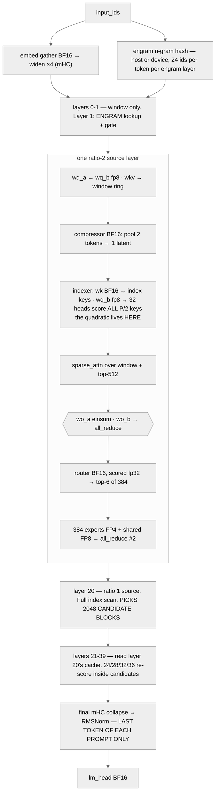
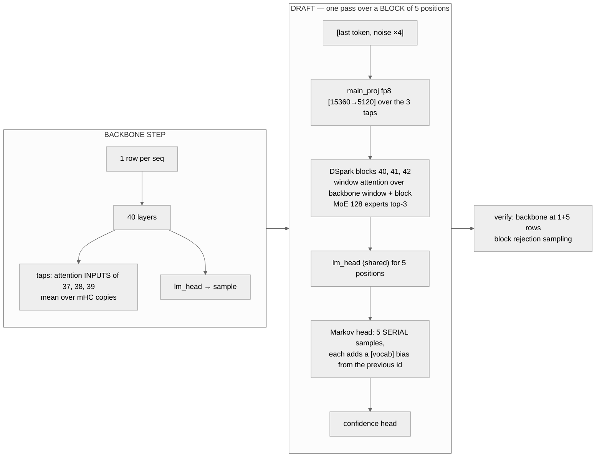

# DeepSeek V4.1 Flash — Working Design Note

**Predicted execution model for DeepSeek V4.1 Flash on 8×H200 SXM, TP4 with engram CPU offload, FP8 / FP4**

Built from the model repo's own files at revision
`dba1be0a40aa45a94ad051997016db3960a90277` of `deepseek-ai/DeepSeek-V4.1-Flash`:

- `config.json` and `inference/config.json`
- `inference/model.py`, `inference/engram.py`, `inference/vision.py`
- `model.safetensors.index.json` (96,085 tensors, 48 shards, total_size 510,286,023,000 B)
- the real safetensors headers of shard 00017 (layer 14's attention, indexer, experts, shared expert, gate, mHC)
- the real safetensors header of shard 00048 (layer 14's engram)

Also used: the vendor's published vLLM recipe for the deployment shape. **No traces.**

Every number is a roofline floor at vendor peak: a lower bound on time, not a target.

Two kinds of figure appear, and they disagree on purpose:

- **Planner output.** `gitm plan` on the catalogue entry.
- **Hand ledger.** Shapes read from the headers and the reference code.

§7 says where and why they differ. Tags:

- **[HDR]** read from one of the two real headers
- **[INFER]** inferred from code and the size closure
- **[A#]** an assumption in §8.2

Reproduce any figure here (against this branch — the planner is actively changing,
so check `git rev-parse HEAD` matches if a number disagrees):

```bash
gitm plan deepseek-v4.1-flash --gpu H200 --batch 32 --kv-len 8192 --tp 4
gitm plan deepseek-v4.1-flash --gpu H200 --batch 32 --kv-len 8192 --tp 4 --spec-tokens 5
gitm plan deepseek-v4.1-flash --gpu H200 --prefill-tokens 8192 --batch 0 --kv-len 0 --tp 4
gitm plan deepseek-v4.1-flash --gpu H200 --sweep 1,4,16,32,64,128,256 --kv-len 8192 --tp 4
gitm plan deepseek-v4.1-flash --gpu B200 --batch 32 --kv-len 8192 --tp 2
```

## Hardware assumption: 8×H200 SXM, NVLink, TP4 with engram CPU offload, FP8 / FP4 weights, FP8 KV

**This is the vendor's own H200 shape.** `recipes.vllm.ai/deepseek-ai/DeepSeek-V4.1-Flash` lists "H200 8-GPU TP4 with offload".

- If production differs, *graph topology does not change*. Only these constants, the per-GPU ledger in §1 and some bound labels do.
- The B200 column is the recipe's other NVIDIA shape.

| Constant | H200 | B200 | Note |
| --- | --- | --- | --- |
| BF16 tensor peak | **989 TFLOP/s** | **2,250 TFLOP/s** | `gitm/planner/context.py` |
| FP8 e4m3 tensor peak | **1,979 TFLOP/s** | **4,500 TFLOP/s** | `_QUANT_PEAKS`, dense, no 2:4 sparsity |
| FP4 tensor peak | **none** | **9,000 TFLOP/s** | Hopper has no fp4 path. fp4 nodes price against the fp8 peak — see below |
| FP32 CUDA-core peak | 67 TFLOP/s | not in `context.py` | the router casts to float (line 811) |
| HBM3e | **4.8 TB/s** | **8.0 TB/s** | `context.py` |
| NVLink | 900 GB/s per GPU | 1,800 GB/s per GPU | `_INTERCONNECT` |
| Memory | 141 GB × 8 = 1,128 GB | 180 GB × 8 [A1] | B200 capacity is a datasheet assumption, not in `context.py` |
| Kernel launch | ~2 µs graph-replay / ~5 µs eager | same | the planner's `serial_launches` floor |

Two warnings from the H200 plan runs:

- **Every H200 plan prints "priced against fallback peaks — the ceiling is low in a known direction".** The routed experts are fp4, and H200 has no fp4 peak, so `resolve_peak` falls back to fp8 (1,979 TFLOP/s). The ridge line reads "412 (fp4)", which is the fp8 ridge wearing the fp4 label.
- **The warning does not move any decode bound label here.** Every decode node is memory-bound or launch-bound at AI ≤ 104 (§4.1). It does matter wherever an fp4 GEMM would approach compute, which is prefill (§3.2).

The recipe, verbatim, because every constant above and every bound label in §4
assumes it:

```bash
vllm serve deepseek-ai/DeepSeek-V4.1-Flash --max-model-len 1048576 --kv-cache-dtype fp8 --speculative-config '{"method":"dspark","num_speculative_tokens":5,"rejection_sample_method":"block","enable_adaptive_verification":false}' --max-num-seqs 128 --max-num-batched-tokens 16384
```

The recipe also names:

- `--enable-expert-parallel` for DEP layouts
- `--engram-config '{"cpu_offload":true}'` for offloaded configs
- `--language-model-only` for text-only serving
- vLLM 0.30.0+ is required

Layouts it names:

| hardware | layout |
|---|---|
| H200 | 8-GPU TP4 with offload |
| B200 / B300 | TP2 or DEP8 |
| GB200 | NVL4 1P1D TP4 per pool |
| MI355X | TP2 |
| MI325X | TP4 with offload |

This note prices the H200 and B200 rows and sizes B300 and GB200 in §1. **The AMD rows are not priced.** MI325X has no entry in `context.py`, and MI355X was not run.

```
H200  FP8  ridge = 1,979e12 / 4.8e12 = 412 FLOP/byte
H200  BF16 ridge =   989e12 / 4.8e12 = 206 FLOP/byte
H200  FP32 ridge =    67e12 / 4.8e12 =  14 FLOP/byte
H200  FP4  ridge = none — priced at the fp8 ridge, 412
B200  FP4  ridge = 9,000e12 / 8.0e12 = 1,125 FLOP/byte
B200  FP8  ridge = 4,500e12 / 8.0e12 =   562 FLOP/byte
B200  BF16 ridge = 2,250e12 / 8.0e12 =   281 FLOP/byte
```

**You need four precisions.**

- Routed experts are fp4.
- The attention linears, the shared expert, the indexer query projection and the engram tables are fp8.
- The compressor, the indexer key projection, the router, the embedding, `lm_head` and the ViT are bf16.
- The mHC mixing weights, the routing biases and `attn_sink` are fp32.

§1's precision table has the evidence.

---

## 1. Layer-by-layer architecture map

### Headline structure

| Property | Value |
| --- | --- |
| Layers | **40** transformer + **3** DSpark draft blocks (`mtp.0`–`mtp.2`) |
| Attention | one 512-wide KV head. **Sliding window 128 on every layer**, plus compressed KV on 38 of 40 |
| Compression schedule | layers 0–1 window only. **2–19 ratio 2. 20–39 ratio 1.** 40–42 window only |
| **KV sources** | only **4** layers compress and cache: **2, 8, 14** (ratio 2) and **20** (ratio 1). The other 34 read their source's cache |
| Indexer | 32 heads × 128, keeps **`index_topk=512`**, on **8** layers: 2, 8, 14, 20, 24, 28, 32, 36. The rest reuse |
| Candidate pre-filter | layer 20 picks **2048 blocks of 8** positions. Layers 24, 28, 32, 36 score only inside them |
| **Engram** | n-gram hash tables on layers **1 and 14**, 384,006,168 and 384,016,682 rows × 256, 2- to 4-grams, 8 heads |
| Experts / top-k | 384 routed, top-6, **1 shared**, `moe_intermediate_size=2304`, on every layer |
| Routing | `sqrtsoftplus`, `noaux_tc`, `routed_scaling_factor=1.5`, a separate `bias_vl` for image tokens, no hash layers |
| hidden_size | 5120 |
| Q heads / q_lora / o_lora × o_groups | 64 / 1280 / **1024 per group × 8** |
| head_dim / rope | **512 total, 64 of it RoPE** (nope 448) |
| mHC | residual widened ×4, Sinkhorn 20 iterations, two per block |
| DSpark | 3 blocks, **128 experts top-3**, block of 5 drafted positions, Markov head rank 256, taps layers 37–39 |
| Vocab | 129,280, untied `lm_head` |
| Max context | 1,048,576 (YaRN factor 16 over 65,536) |
| Vision | 32-layer ViT, width 1024, aligner into 5120 |
| Total / active params | **763.20 B** in the checkpoint. **551.57 B** text backbone. ~16.8 B active per token [INFER] |

**The parameter count:**

| part | parameters |
|---|---:|
| routed experts, 40 × 384 × 35,389,440 | 543,581,798,400 |
| shared, attention, gates, compressors, indexers, mHC, 40 layers | 6,660,030,464 |
| embedding + lm_head | 1,323,827,200 |
| **text backbone** | **551,565,656,064** |
| engram tables + wkv + q/k | 196,928,504,320 |
| DSpark blocks and heads | 14,225,315,072 |
| ViT + aligner | 485,253,120 |
| **everything** | **763,204,728,576** |

- **The text backbone is 551.57 B**, with engram, DSpark and vision left out.
- Active per token is the backbone's non-expert 7.98 B, plus 6 of 384 experts on 40 layers (8.49 B), plus the engram `wkv` pair (0.31 B). The embedding is counted whole, so this is slightly high.

### Semantics read from the checkpoint, not guessed

From `inference/model.py`:

- **A nonzero `compress_ratios` entry does not mean the layer compresses.** Only `kv_source_layers` do. The rest read the cache the last source published (lines 80–84, 618–619, 654–679).
- **The same holds for indexers.** Only `index_source_layers` run one. The layers between them reuse the published top-k (lines 725–737).
- **Index keys belong to the KV sources only** (line 500). Indexers on 24–36 read layer 20's keys.
- **Ratio 1 is not "uncompressed".** It is a second, projected latent per token, attended sparsely at top-512 (lines 446, 461–462).
- **`dspark_target_layer_ids` [37, 38, 39] are taps.** Their attention inputs are averaged over the mHC copies and fed to the draft's `main_proj` (lines 1265–1266, 1113). They are not layers with extra weights.

**The schedule is proven from the weight map, not inferred.**

| tensor | present on |
|---|---|
| `attn.compressor.wkv` | layers 2, 8, 14, 20 only |
| `attn.compressor.wgate` | 2, 8, 14 (ratio 1 needs no gate) |
| `attn.indexer.wq_b` | 2, 8, 14, 20, 24, 28, 32, 36 |
| `attn.indexer.wk` | 2, 8, 14, 20 |
| `engram.*` | 1 and 14 |
| `mtp.N.ffn.experts.*` | 128 each |
| `layers.37`–`39` | 2,334 tensors, identical to a plain layer like 21 |

A reader that charged every compressed layer its own cache, compressor and indexer would overstate:

- KV by 13.9×
- compressors by 9.5× (38 against 4)
- indexers by 4.75× (38 against 8)

The planner does exactly that (§7, G2).

**Config-versus-code contradictions**, every one surfaced, none smoothed into the entry:

- **C1.** `expert_dtype` sits inside `quantization_config`, not at top level as in V4 Pro. The experts' safetensors dtype is **I8**, not an fp4 type [HDR]. A dtype-driven reader sees int8.
- **C2.** Key names differ between `config.json` and `inference/config.json`. Values agree.

  | config.json | inference/config.json |
  |---|---|
  | kv_source_layer_ids | kv_source_layers |
  | index_source_layer_ids | index_source_layers |
  | candidate_source_layer_id | candidate_source_layer |
  | engram_pad_token_id | engram_pad_id |
  | dspark_num_experts_per_tok | dspark_n_activated_experts |
  | sliding_window | window_size |
  | routed_scaling_factor | route_scale |

- **C3.** A nonzero `compress_ratios` entry does not mean the layer compresses its own KV (line 618). The config gives no hint beyond `kv_source_layer_ids`.
- **C4.** Ratio 1 is not "uncompressed" (lines 446, 461–462). The field comment in `roofline.py` says "0 or 1 == uncompressed (full attention)".
- **C5.** `head_dim` 512 includes the 64 RoPE dims. wq_b is [32768, 1280] = 64 × 512 and wkv [512, 5120] [HDR], with `nope_head_dim = head_dim - rope_head_dim` at line 632.
- **C6.** `o_lora_rank` is per group. wo_a is [8192, 4096] = 8 groups × 1024 [HDR].
- **C7.** wo_a is built BF16 in code (line 648) and the code says `convert.py` dequantizes it (line 784). The header says F8_E4M3.
- **C8.** Compressor wkv and wgate are built fp32 for ratio above 1 (lines 446–448). The header says BF16.
- **C9.** `num_nextn_predict_layers` 3 reads as NextN MTP. The code builds DSpark blocks only when `dspark_block_size` is set (line 1209), with 128 experts top-3 (lines 142–149). The reference never calls `forward_spec` (lines 129–130).
- **C10.** `dspark_target_layer_ids` are taps (line 1265). Layers 37–39 carry the same 2,334 tensors as layer 21. `dspark_markov_rank` 256 is the Markov head width (line 1117).
- **C11.** Caches are allocated at the default dtype, but values are quantized three ways:
  - window: fp8 (line 707)
  - compressed: fp4 with e4m3 scales per 16 (line 760)
  - index keys: fp4 with e8m0 per 32 (line 546)

  The recipe says fp8.
- **C12.** `rms_norm_eps` is 1e-20 in both config and code. Any engine default of 1e-6 is wrong. A trap, not a contradiction.

Attention shapes, per token per layer [HDR]:

| Quantity | Shape | Purpose |
| --- | --- | --- |
| Q latent (`wq_a`) | 1280 | replicated low-rank query |
| Q per head (`wq_b`) | 64 × 512 = 32,768 | 448 nope + 64 rope, **inside** 512 |
| **window KV entry** (`wkv`) | **512** | every layer, 128-slot ring |
| **compressed KV entry** | **512** | written by the 4 sources only |
| index key | 128 | written by the 4 sources only |
| Indexer query (`indexer.wq_b`) | 32 × 128 = 4,096 | on the 8 index sources |
| `wo_a` (grouped) | 8 × [1024, 4096] | per-group rank, block-diagonal einsum (line 787) |
| `wo_b` | [5120, 8192] | back to `d_model` |

`num_key_value_heads: 1` is honest here, unlike GLM's 64. One latent is shared by all 64 query heads, and TP buys no KV bandwidth.

### The 43-row table, collapsed to archetypes

| Archetype | Layers | Count | Attention | Indexer | KV growth per token (fp8) | Extra |
| --- | --- | ---: | --- | --- | ---: | --- |
| `Lw` | 0 | 1 | window only | — | 0 | |
| `Lw,e` | 1 | 1 | window only | — | 0 | **engram** |
| `L2,src` | 2, 8, 14 | 3 | window + top-512 of own ratio-2 cache | own, full scan | 320 B | compressor (wkv + wgate). **Engram on 14** |
| `L2,rd` | 3–7, 9–13, 15–19 | 15 | window + source's cache | reuse | 0 | |
| `L1,src` | 20 | 1 | window + top-512 of own ratio-1 cache | own, full scan, **candidate source** | 640 B | compressor (wkv only) |
| `L1,ix` | 24, 28, 32, 36 | 4 | window + layer 20's cache | own weights, **inside candidates** | 0 | |
| `L1,rd` | 21–23, 25–27, 29–31, 33–35, 37–39 | 15 | window + layer 20's cache | reuse | 0 | 37–39 are DSpark taps |
| `Ldsp` | 40, 41, 42 | 3 | window only | — | 0 | 128 experts top-3. Runs **only under a speculative config** |

- The stack is 2 + 3 + 15 + 1 + 4 + 15 = **40**.
- Every block carries the same MoE: 384 × 2304 on 0–39, 128 × 2304 on `Ldsp`.
- Every block carries two mHC mixes.
- Collectives per block in the reference code:
  - an all-reduce after `wo_b` (line 275) and after the MoE (line 902)
  - an index-score all-reduce on the 8 indexer layers (line 559)
  - an engram all-reduce on 1 and 14 (line 324)

### Verification — three independent checks

| check | predicted | published | error |
| --- | --- | --- | --- |
| layer 14, shard 00017 | 7,405,694,680 B from [HDR] shapes | shard extent 7,405,694,680 B | **0, byte for byte** |
| whole checkpoint | **510,286,023,000 B** from the ledger below | total_size 510,286,023,000 B | **0, zero residual** |
| tensor count | 96,085 | 96,085 | **0** |
| planner `model_weight_bytes` | 316,399,407,824 B | 510,286,023,000 B | **−38.0 %** — see §7 |

The tensor count closes as follows:

- 2,334 per plain layer
- plus 3 per compressor-2, 2 per compressor-1, 3 per indexer, 2 per index-key owner, 6 per engram
- sums: 93,415 `layers.*`, 2,401 `mtp.*`, 259 `vision.*`, 4 `aligner.*`, 6 top-level = 96,085

The shape ledger. h = 5120, inter = 2304. Byte rates from the code:

- fp8 = 1 B plus an e8m0 scale per 32×32 block (lines 225–233, `weight_block_size` [32, 32])
- fp4 = 0.5 B plus an e8m0 scale per 32 (lines 219–224), stored as I8 [HDR]

Per routed expert [HDR]:

- w1 I8 [2304, 2560], w2 I8 [5120, 1152], w3 I8 [2304, 2560]: 3 × 5,898,240 B
- scales [2304, 160], [5120, 72], [2304, 160]: 3 × 368,640 B
- total **18,800,640 B**

| term | per unit (B) | count | bytes | dtype |
|---|---:|---:|---:|---|
| routed experts, backbone | 384 × 18,800,640 = 7,219,445,760 | 40 | 288,777,830,400 | HDR |
| routed experts, DSpark (lines 142–149) | 128 × 18,800,640 = 2,406,481,920 | 3 | 7,219,445,760 | INFER |
| shared expert, F8_E4M3 | 3 × 11,796,480 + 3 × 11,520 = 35,424,000 | 43 | 1,523,232,000 | HDR |
| attention wq_a, wq_b, wkv, wo_a, wo_b, fp8 + scales | 126,739,200 | 43 | 5,449,785,600 | HDR |
| gate weight BF16 + bias + bias_vl F32, backbone | 3,935,232 | 40 | 157,409,280 | HDR |
| gate, DSpark (128 experts) | 1,311,744 | 3 | 3,935,232 | INFER |
| mHC fns [24, 20480] F32, bases, scales | 3,932,376 | 43 | 169,092,168 | HDR |
| attn_sink + 4 norms | 24,320 | 43 | 1,045,760 | HDR |
| compressor ratio 2 (wkv, wgate, norm), BF16 | 10,486,784 | 3 | 31,460,352 | HDR |
| compressor ratio 1 (wkv, norm), BF16 | 5,243,904 | 1 | 5,243,904 | INFER, line 446 |
| indexer wq_b fp8 + weights_proj BF16 | 5,575,680 | 8 | 44,605,440 | HDR |
| indexer wk + k_norm, BF16 | 131,328 | 4 | 525,312 | HDR |
| engram layer 14 | 101,537,925,968 | 1 | 101,537,925,968 | HDR |
| engram layer 1 (384,006,168 rows) | 101,535,150,272 | 1 | 101,535,150,272 | INFER |
| embedding + lm_head, BF16 | 129280 × 5120 × 2 = 1,323,827,200 | 2 | 2,647,654,400 | INFER, line 1005 |
| final norm + 3 image delimiters | | | 40,960 | INFER |
| DSpark main_proj [5120, 15360] fp8 + main_norm | 78,730,240 | 1 | 78,730,240 | INFER |
| DSpark Markov embed + head [129280, 256] BF16, norm, confidence proj | 132,403,712 | 1 | 132,403,712 | INFER |
| ViT (32 blocks) + patch embed + aligner, BF16 | 485,253,120 params | 1 | 970,506,240 | INFER |
| **sum** | | | **510,286,023,000** | |

Attention per block [HDR]:

| tensor | shape | bytes with scales |
|---|---|---:|
| wq_a | [1280, 5120] | 6,560,000 |
| wq_b | [32768, 1280] | 41,984,000 |
| wkv | [512, 5120] | 2,624,000 |
| wo_a | [8192, 4096] | 33,587,200 |
| wo_b | [5120, 8192] | 41,984,000 |

Engram per layer [HDR]:

- rows × 256 F8_E4M3, plus rows × 8 F8_E8M0
- `q_weight` and `k_weight` BF16 [4, 5120]: 81,920 B
- `wkv` F8_E4M3 [25600, 6144] plus scale [800, 192]: 157,440,000 B
- `wkv` input 6144 = (4 − 1) n-gram sizes × 8 heads × 256 (line 344). Output 25600 = 5120 × (4 + 1) (line 345)

**The engram tables are 203.07 GB, 39.8 % of the checkpoint.** The "about 197 GB" figure counts only the fp8 rows, 196.61 GB (C26). The e8m0 scales add 6.14 GB and the two `wkv` projections 0.31 GB.

The closure being exact matters for [INFER]. Every dtype outside shards 00017 and 00048 is an inference. A zero residual across 96,085 tensors is the check on all of them at once.

### KV cache — the number that drives decode

```
per token of context, whole model (fp8, 1 B per element [A5]):
  sources 2, 8, 14 (ratio 2):  3 × (512 latent + 128 index key) / 2  =   960 B
  source 20       (ratio 1):       512 latent + 128 index key         =   640 B
  the other 34 compressed layers read those caches                    +     0
                                                                       = 1,600 B/token

fixed per sequence:
  128-slot window on all 43 blocks:  43 × 128 × 512                 = 2,818,048 B
  fp32 compressor state, 3 ratio-2 sources:  3 × 8,192                =    24,576 B

as trained (fp4 compressed + e4m3/16, fp4 index keys + e8m0/32, lines 760, 546):
  3 × (288 + 68) / 2  +  (288 + 68)                                  =   890 B/token

the planner (kv_bytes_per_token on this entry):                      22,276.53 B/token
  every ratio-2 and ratio-1 layer charged its own cache and index key,
  at 576-wide entries (C17)                                           — 13.9× the code
```

| Context | fp8, code | fp4 as trained (growth only) | planner |
| --- | ---: | ---: | ---: |
| 8,192 | 15,949,824 B = 0.016 GB | 0.007 GB | 0.18 GB |
| 131,072 | **212,557,824 B = 0.21 GB** | 0.12 GB | 2.92 GB |
| 1,048,576 | **1,680,564,224 B = 1.68 GB** | 0.93 GB | **23.36 GB** |

**Replicated, not sharded.** With one KV head, every TP rank holds and reads the whole cache. Under DEP (DP attention), each GPU holds only its own sequences.

**Per-GPU ledger — weights, KV room and fit, with and without engram offload** [A1][A2][A3][A4][A6][A9].

The checkpoint splits as:

- **Split N ways (506,634,824,720 B):**
  - routed experts
  - wq_b, wo_a, wo_b
  - indexer wq_b and weights_proj
  - embedding, lm_head, Markov head
  - engram rows, 202,758,032,400 B of the total
- **Replicated (3,651,198,280 B):** everything else, including the shared expert (line 887, plain `Linear`)

Weights per GPU = split / N + replicated. KV room = 0.9 × HBM − weights.

| layout | engram | weights per GPU | KV room per GPU | seqs at 1M | seqs at 128K |
|---|---|---:|---:|---:|---:|
| 8×H200 TP8 | on GPU | 66.98 GB | 59.92 GB | 35 | 281 |
| 8×H200 TP8 | offload | 41.64 | 85.26 | 50 | 401 |
| **H200 TP4 (recipe)** | on GPU | 130.31 | **−3.41, no fit** | 0 | 0 |
| **H200 TP4 (recipe)** | **offload** | **79.62** | **47.28** | **28** | **222** |
| B200 TP2 (recipe) | on GPU | 256.97 | **no fit** | 0 | 0 |
| B200 TP2 (recipe) | offload | 155.59 | 6.41 | 3 | 30 |
| B200 DEP8 (recipe) | on GPU | 73.88 | 88.12 | 52 per GPU | 414 per GPU |
| B200 DEP8 (recipe) | offload | 48.53 | 113.47 | 67 per GPU | 533 per GPU |
| B300 TP2 (recipe), 288 GB [A1] | on GPU | 256.97 | 2.23 | 1 | 10 |
| GB200 NVL4 TP4 per pool (recipe), 186 GB [A1] | on GPU | 130.31 | 37.09 | 22 | 174 |

Reading the table:

- **The recipe's H200 shape only fits because of the offload.** Without it, TP4 needs 130.31 GB per GPU against 126.9 GB usable.
- **The recipe's `--max-num-seqs 128` cannot all run at 1M on H200 TP4.** 28 fit per instance at 1M, 222 at 128K.
- **Offload needs 202.76 GB of host memory per model copy.** Two TP4 instances on one 8×H200 node would need 405.5 GB if each holds its own copy (Q9).
- **`--language-model-only`** drops the 0.97 GB ViT from every row.

### FP8 and FP4 — what is and is not quantized

| Component | Precision | Evidence |
| --- | --- | --- |
| attention `wq_a`, `wq_b`, `wkv`, **`wo_a`**, `wo_b` | **FP8 e4m3**, 32×32 e8m0 block | [HDR]. Code builds `wo_a` bf16 (C7) |
| routed experts | **FP4 e2m1, stored I8**, e8m0 per 32 | [HDR] |
| shared expert | **FP8 e4m3** | [HDR]. Not fp4 |
| indexer `wq_b` | FP8 e4m3 | [HDR] |
| indexer `weights_proj`, `wk`, `k_norm` | **BF16** | [HDR] |
| compressor `wkv`, `wgate`, `norm` | **BF16** | [HDR]. Code promotes to fp32 (C8) |
| router `gate.weight` | **BF16** | [HDR]. Scored in fp32 (line 811) |
| `gate.bias`, `gate.bias_vl`, `attn_sink`, mHC fns/bases/scales | **FP32** | [HDR] |
| engram table rows | **FP8 e4m3** + e8m0 per 32 | [HDR]. Dequantized on lookup (line 319) |
| engram `wkv` / `q_weight`, `k_weight` | FP8 e4m3 / BF16 | [HDR] |
| all norms | BF16 | [HDR] |
| embedding, `lm_head` | **BF16** | [INFER], line 1005 comment, closure |
| DSpark blocks | as backbone. `main_proj` fp8. Markov head, confidence proj BF16 | [INFER], line 1092 comment, closure |
| ViT + aligner | BF16 | [INFER], closure |
| KV cache | window fp8, compressed fp4 + e4m3/16, index keys fp4 + e8m0/32 **as trained**. **fp8 as served** [A5] | lines 707, 760, 546. Recipe `--kv-cache-dtype fp8` |

**Four precisions inside one layer**, and the split is not where a V3-trained eye expects it:

- The shared expert is **fp8** while the routed experts are fp4.
- The indexer's key path is **bf16** while its query projection is fp8.
- The router weight is bf16 but scores in fp32.

`SparseMoEModelSpec` has one `expert_dtype` for both expert kinds and one `weight_dtype` for everything else, so none of this is representable (§7, G8).

---

## 2. Per-phase execution diagrams

### 2.1 Prefill — a chunk of P tokens against C cached



**The structural claim of prefill.** With 384 experts and top-6, a chunk of P tokens issues 6P assignments. Once 6P ≫ 384, every layer reads its whole expert bank, which is 7.22 GB per layer at full size.

**The quadratic sits in the eight indexer scans, not in the core.**

- Layers 2, 8, 14 score P × P/2 key pairs. Layer 20 scores P × P.
- Layers 24–36 score only inside layer 20's 16,384 candidates, *if* the engine restricts the einsum. The reference computes all keys and masks afterwards (lines 556, 575).
- The core is capped at 128 + 512 positions per query on every compressed layer.

**Engram adds a host-side term under offload.** 12,672 B of table rows per prompt token cross PCIe, which is 103.8 MB at P = 8,192. That is small in bytes and unknown in latency (Q3).

**The planner's prefill figure is not a prediction.** `gitm plan --prefill-tokens 8192` prints:

- a floor of 0.583 ms (14,039,631 tok/s)
- `moe_routed`, `attn_score_value` and `tp_all_reduce` at 0.000 ms
- every node at t_comp 0 and AI 0

`sparse_moe` has no prefill path. The graph was built for decode and a zero-row batch leaves only the weight reads. GLM-5.2's G2 is the same gap, shipped for that family (§7, G11). No hand prefill figure is given either, because pricing the indexer quadratic honestly needs `kernel.py`, which was not read (Q11).

### 2.2 Decode — steady state, B sequences, one token each

Identical node set to prefill. What changes kind:

| operator | prefill class | decode class | why the class itself changes |
| --- | --- | --- | --- |
| attention core | per query tile, causal | **one query against window + top-512** | selection bounds both FLOPs and bytes per sequence |
| indexer scan | `O(P·C + P²/2)`, compute-bound | `O(B·C)`, **memory-bound** — streams the source's whole key set | the query count collapses from P to B |
| compressor | pools full groups | **fires once every `ratio` steps** (line 477) on 4 layers | ratio 2 on sources 2/8/14, every step on 20 |
| every GEMM | M = P, compute-bound | M = B, **weight-streaming** | same kernel, different regime |
| engram | P lookups, one gather | B lookups per step, **one host round trip per engram layer under offload** | the table never moves, only rows |
| `lm_head` | one row per request | every row, every step | the epilogue is free in prefill and is not in decode |

```
  [hidden BF16 B×4×5120]  ← mHC: 4 copies of the residual stream
        │
   (layers 1, 14) ENGRAM: hash → 24 rows × 264 B from the table (HOST under offload)
        │             → wkv fp8 [6144→25600] → gated add into all 4 copies
        │
   hc_mixes (F32 [24, 20480]) ─▶ hc_pre ─▶ RMSNorm
        │
   wq_a fp8 (REPLICATED, 1280) ─▶ q_norm ─▶ wq_b fp8 (64×512, sharded)
   wkv fp8 (REPLICATED, 512)   ─▶ window ring APPEND (every layer)
        │
   ┌────┴────────────────────────────────────────────────┐
   │ source (2, 8, 14, 20)? → compressor BF16, write      │ ← the ONLY KV that grows
   │                          latent + index key          │
   │ index source (8 layers)? → score the source's keys   │ ← the ONLY term that grows
   │   24/28/32/36: inside layer 20's candidates only?    │   with S apart from KV
   │ else → reuse the published top-512. NO KERNEL.       │
   └────┬────────────────────────────────────────────────┘
        │
   sparse_attn over 128 window + ≤512 selected ·· 327,680 B per compressed layer per seq
        │                                         FLAT IN CONTEXT, not divided by TP
   wo_a einsum (8 groups) ─▶ wo_b fp8 ─▶ all_reduce #1
        │
   hc_post ─▶ hc_mixes ─▶ RMSNorm ─▶ router BF16 (scored fp32) ─▶ +bias ─▶ top-6 of 384
        │
        ├─▶ reference: bincount(...).tolist() ─▶ D2H every layer (line 894) · S1
        │
   384 experts FP4 (distinct(B) of them) + shared FP8 ─▶ all_reduce #2 ─▶ hc_post
        ▼
   … ×40 layers, then:
   hc_pre collapse ─▶ RMSNorm ─▶ lm_head BF16 ─▶ all_gather ─▶ sample ─▶ D2H
```

### 2.3 Encoders — there is one, and it is off the text path

V4.1 Flash ships a **32-layer ViT** (width 1024, 16 heads, 2D RoPE, patch 14) and a two-layer aligner into the 5120-wide stream. It is 485.25 M parameters and 0.97 GB bf16 [INFER] (`inference/vision.py`). The presence matters three ways:

1. **Prefill with an image starts at the ViT.** Images must sit in the first prefill chunk (line 1255). The planner has no node for any of it.
2. **Image tokens change routing.** Every gate carries `bias_vl`, selected per token by an image mask (lines 807, 819–820). Engram is masked off inside image spans (line 1251).
3. **Text-only serving can drop it.** `--language-model-only` removes 0.97 GB per GPU from every §1 fit row. A text trace then has no second model hiding in it, so every kernel should map to a §3 node (§6.4 row 6).


### 2.4 MTP-on decode — DSpark draft and verify



**DSpark is not GLM's MTP chain.**

- It drafts **a block of 5 positions in one pass** through three blocks, which is no per-token serial stage through the MoE.
- The only serial part is the Markov head's sampling loop (lines 1149–1153). That loop is a 256-wide embedding and a [vocab, 256] head per position.
- The draft blocks carry **128 experts top-3**, not the backbone's 384 top-6.
- Their attention is window-only over the backbone's own window plus the drafted block (`get_dspark_topk_idxs`, lines 1021–1029).

**The reference never runs this loop** (lines 129–130). The recipe does, with `num_speculative_tokens` 5 = `dspark_block_size` 5 and `rejection_sample_method` "block". So the verify semantics come from the recipe, not the code (Q7).

**The planner prices it as something else** (§3.3, §7 G5).

---

## 3. Predicted execution graph

The 43 blocks collapse to **eight archetypes** (§1) plus a prologue and an epilogue. Planner figures are at **B = 32, S = 8,192, TP4, per rank, H200**. The hand ledger in §4.1 adds S = 1M.

**Per-op tables are in Appendix A.** The CLI prints per-op aggregates, not per-layer rows (A.5).

### 3.1 Prologue and epilogue

| id | operator | kernel class | shape per rank (TP4) | hand bytes | planner |
| --- | --- | --- | --- | --- | --- |
| D0 | engram hash | integer hash, **host or device** | `[B] → [B, 2, 24]` ids | ids only | **absent** |
| D1 | `embed` | gather + all_reduce (line 177) | `[32] → [32, 5120]` BF16 | 0.33 MB | **absent** |
| D2 | mHC widen | repeat ×4 (line 1258) | `[32, 4, 5120]` | activations | absent |
| E0 | hc_pre + RMSNorm | fused | `[32, 5120]` | activations | absent |
| E1 | `lm_head` | GEMM, vocab-sharded `[5120 → 32,320]` | **BF16 331.0 MB** | 331.0 MB | 0.035 ms ≈ 168 MB — **priced at fp8** (C20) |
| E2 | logits all_gather | collective | `[32, 32,320] → [32, 129,280]` fp32 | 16.5 MB | absent |

**D0 is the node this model adds.** Under offload, the hash ids go to host, 24 rows per engram layer come back, and `wkv` runs on GPU. It is a host round trip on the critical path before layer 1 and again before layer 14, unless the engine prefetches (S2).

### 3.2 What prefill changes

**The planner's prefill output cannot be used** (§2.1). What changes structurally, from the code, with no floor attached:

- **Every projection crosses into compute at large P.** On H200 the fp4 experts price against the fp8 peak (the fallback warning). The expert GEMMs' compute floor is therefore wrong by the fp4/fp8 ratio the hardware does not have, which is a direction, not a number.
- **Eight indexer scans are the quadratic.** Three at P × P/2 and one at P × P. The other four are also P × P unless the engine restricts them to P × 16,384 (Q5).
- **The compressors run on 4 layers, not 38.**
- **Engram moves 12,672 B per prompt token over PCIe under offload.**
- **Chunking multiplies the expert bank.** The recipe pins `--max-num-batched-tokens 16384`, so an 8,192-token prompt is one chunk and a 1M-token prompt is **64 chunks**, each re-reading the whole bank.

### 3.3 MTP — the whole-step economics

What the planner prints at B = 32, S = 8,192, TP4, H200:

| pass | nodes | floor | tok/s at α = 0 |
| --- | ---: | ---: | ---: |
| vanilla decode (D = 0) | 631 | 7.442 ms | 4,300 |
| `--spec-tokens 5` | **631** | **16.799 ms** | 1,905 |

**Cost ratio 2.257×.** The planner's prefix-chain break-even is where `(1−α⁶)/(1−α)` = 2.257, at **α ≈ 0.573**.

**That is the planner's economics, not DSpark's.**

- The node count does not move (631 both times). The sparse_moe graph has no draft stages. It runs the same 43 blocks at 6× the rows.
- Those 43 blocks already include the 3 DSpark blocks, priced as backbone layers with 384 experts on **every** step, D = 0 included (G5).
- DSpark's real draft is one pass through 3 blocks at 128 experts top-3, then a serial 5-sample Markov loop (§2.4).

No hand DSpark figure is given. The reference implements none of the loop, and the vLLM path was not read.

### 3.4 Predicted synchronization points

| # | Where | Kind | conf | Trace signature if real |
| --- | --- | --- | --- | --- |
| **S1** | after the gate, every layer | host readback of expert counts — the reference does `bincount(...).tolist()` (line 894) | **high in the reference, low in an engine** | 43 D2H per decoded token. Fatal for graph capture |
| **S2** | before layers 1 and 14, under offload | host gather of 24 engram rows per token per layer, then H2D | medium | 2 H2D copies per step, B × 6,336 B each. Serial unless prefetched |
| S3 | each all-reduce | stream wait. 2 per layer, +8 index-score, +2 engram | medium | ~92 per step at TP4 |
| S4 | sampling | D2H of sampled ids | **high** | one per step, unavoidable |
| S5 | scheduler | host work between steps | medium | CPU-shaped inter-step gap |
| S6 | DSpark Markov loop | 5 serial samples per draft (lines 1149–1153) | medium | 5 small kernels + sampling in series |
| S7 | verify accept/reject | host-visible variable-length result | **high** it exists | a D2H whose value decides how far the sequence advanced |
| S8 | candidate handoff 20 → 24–36 | device-side in the reference (`shared_attn.candidates`) | medium | none, unless an engine round-trips it |

**S1 and S2 are the two worth chasing first.** S1 is a known reference-code habit that a serving engine should not have. S2 is the price of the offload that makes the recipe's H200 shape fit at all.

---

## 4. Execution-bound / roofline hypotheses

Five labels: **compute · memory-bandwidth · communication · launch/sync/latency · mixed**. Labels are against peak.

§4.1 is a node table from the planner, beside the hand ledger. §4.2 is a region table.

### 4.1 Decode as a node table — B=32, S=8192, TP4, FP8/FP4, per rank

Planner, H200. Bytes are derived as t_mem × 4.8 TB/s from the printed three-decimal ms, so each is ±2.4 MB. Full output in A.1.

| node | bytes | AI | ×N | Σ ms | bound | share |
| --- | ---: | ---: | ---: | ---: | --- | ---: |
| `moe_routed` | 30.77 GB | 4.7 | 43 | **6.410** | memory | **86.1 %** |
| `attn_index_score` | 0.97 GB | 64.0 | 38 | 0.203 | memory | 2.7 % |
| `mhc_mix` | 0.60 GB | 5.2 | 86 | 0.172 | launch | 2.3 % |
| `attn_q_b` | 0.54 GB | 60.5 | 43 | 0.112 | memory | 1.5 % |
| `attn_score_value` | 0.51 GB | 54.4 | 43 | 0.107 | memory | 1.4 % |
| `attn_kv_a` | 0.48 GB | 61.2 | 43 | 0.101 | memory | 1.4 % |
| `attn_out_proj` · `attn_q_a` | 0.31 / 0.30 GB | 55.8 / 60.2 | 43 each | 0.065 / 0.062 | memory | 0.9 / 0.8 % |
| `moe_shared` · `tp_all_reduce` · `attn_index_proj` | 0.24 / 0.23 / 0.21 GB | — | 43 / 43 / 38 | 0.049 / 0.047 / 0.044 | memory | 0.6–0.7 % |
| `lm_head` · `moe_router` · `attn_qnorm_rope_insert` · `attn_kv_compress` | 0.17 / 0.10 / 0.07 / 0.005 GB | — | 1 / 43 / 43 / 38 | 0.035 / 0.021 / 0.014 / 0.001 | memory | 0.9 % total |
| **631 nodes** | | | | **7.442** | | **4,300 tok/s** |

631 nodes: 0 compute-bound, 86 launch-bound (all `mhc_mix`), the rest memory.

**The hand ledger at the same point, and why it disagrees.**

Hand figure at B = 32, S = 8,192, TP4 with offload, 40 layers:

- constant weights 3,968,957,888 B (breakdown below)
- routed experts 152.01 × 18,800,640 × 40 / 4 = 28,578,852,864 B
- KV 32 × 19,398,656 = 620,756,992 B
- total **33.17 GB → 6.910 ms** at 4.8 TB/s

| term | hand | planner | why they differ |
| --- | ---: | ---: | --- |
| routed experts | 28.58 GB | 30.77 GB | the planner runs the 3 DSpark blocks every step at 384 experts (G5). 28.58 × 43/40 = 30.72 |
| index-key scans | 0.22 GB | 0.97 GB | the planner scans on 38 layers, each over its own keys (G2). The code scans on 8, over 4 sources' keys |
| attention core read | 0.40 GB | 0.51 GB | 640-byte entries in the planner against 512 (C17), and 5 more window layers |
| shared expert | 1.42 GB | 0.24 GB | the planner shards it by tp and prices it at fp4 (C19). The reference replicates it at fp8 |
| `lm_head` | 0.33 GB | 0.17 GB | fp8 against bf16 (C20) |
| engram `wkv` | 0.32 GB | absent | G1 |
| mHC | 0.16 GB weights | 0.172 ms launch | the planner prices 86 launches at 2 µs. The hand ledger counts bytes only [A10] |
| **floor** | **6.910 ms** | **7.442 ms** | |

The hand constant term is:

- attention linears 1.54 GB
- shared expert 1.42 GB
- router + mHC 0.31 GB
- lm_head 0.33 GB
- engram wkv 0.32 GB
- compressor and indexer weights 0.05 GB

**The two floors are 8 % apart, and the net hides larger opposite errors.**

- The DSpark blocks add +2.19 GB.
- The shared expert takes away −1.18 GB.
- Index scans are 4.5× high.

The dangerous error is not in this table. It is the KV footprint (13.9×), which sets concurrency, not step time (§7.2).

**The hand ledger at 1M context, where the planner was not run.** H200 TP4 with offload, 40 layers [A7][A8][A10].

Distinct experts touched = 384 × (1 − (378/384)^B): 6 at B = 1, 85.53 at B = 16.

Per sequence per step:

- window + top-512 on 38 layers, window only on 2: 38 × 640 × 512 + 2 × 128 × 512 = **12,582,912 B**
- index-key scans at 1M, as the reference does them: **872,415,232 B**
  - layers 2, 8, 14 read 524,288 keys × 128 B each
  - layers 20, 24, 28, 32, 36 read 1,048,576 keys × 128 B each

| term | B = 1 | B = 16 |
|---|---:|---:|
| attention linears, 40 × (117,555,200 / 4 + 9,184,000) | 1.54 GB | 1.54 GB |
| shared expert, replicated | 1.42 | 1.42 |
| router + mHC | 0.31 | 0.31 |
| lm_head / 4 | 0.33 | 0.33 |
| engram wkv (on GPU under offload) | 0.32 | 0.32 |
| compressor + indexer weights | 0.05 | 0.05 |
| routed experts, distinct × 18,800,640 × 40 / 4 | 1.13 | 16.08 |
| window + selected KV | 0.01 | 0.20 |
| index-key scans | 0.87 | 13.96 |
| **total** | **5.98 GB** | **34.21 GB** |
| floor at 4.8 TB/s | 1.25 ms | 7.13 ms |
| tokens/s per TP4 instance | 802 | 2,245 |
| floor at 8.0 TB/s (B200) | 0.75 ms | 4.28 ms |

- **At 1M the index scans are 40.8 % of the B = 16 step.** Layers 24–36 alone are 8.59 GB of them (§5 rank 1).
- Engram lookups add 2 × 24 rows × 264 B = 12,672 B per token over PCIe, which is 202,752 B per step at B = 16.
- At B = 1 the six experts land on at most six GPUs, and the slowest GPU sets the step. Balanced 1.13 GB is the optimistic case.

**The batch story** (planner, H200 TP4, S = 8,192, A.5):

| B | floor | tok/s | compute-bound nodes |
| --- | --- | --- | --- |
| 1 | 0.891 ms | 1,123 | 0 / 631 |
| 4 | 1.664 ms | 2,404 | 0 |
| 16 | 4.434 ms | 3,608 | 0 |
| 32 | 7.442 ms | 4,300 | 0 |
| 64 | 11.796 ms | 5,426 | 0 |
| 128 | 16.611 ms | 7,706 | 0 |
| 256 | 20.620 ms | 12,415 | 44 |

**Hardware sensitivity.** The planner's B200 TP2 at the same B and S is 8.493 ms and 3,768 tok/s. That is slower than H200 TP4, because TP2 doubles each GPU's expert share. `moe_routed` is 90.5 % of the step. B200 TP2 also only fits with offload (§1).

### 4.2 Prefill and MTP — regions and what flips them

| Phase | Region | Bound | Why (point at a number) | Precision / peak | Flip variable |
| --- | --- | --- | --- | --- | --- |
| **Pre** | expert bank | ⚑ compute on B200, **fallback-priced on H200** | 6P ≫ 384 wakes all experts. The recipe's 16,384-token chunk re-reads the bank per chunk | FP4 weights. H200 has no fp4 peak | GPU, chunk size |
| **Pre** | indexer scans, 4 full + 4 candidate | compute at large P | P × P/2 on 2/8/14, P × P on 20 | FP8 query, FP4-trained keys | P, ⚑ **candidate restriction** (Q5) |
| **Pre** | engram gather | host / PCIe | 12,672 B per token. 103.8 MB at P = 8,192 | FP8 rows | ⚑ **offload on/off** |
| **Pre** | whole pass | **not predicted** | the planner has no prefill path (G11). No hand figure (Q11) | — | — |
| **MTP** | planner's verify | memory | 631 nodes at 6× rows. 16.799 ms against 7.442 | FP4 experts | D. Priced as rows, not as DSpark (G5) |
| **MTP** | DSpark draft | **not predicted** | one pass, 3 blocks, 128 experts top-3, serial Markov loop | FP4 / FP8 / BF16 | the vLLM DSpark path (Q7) |

### 4.3 Flip-variable index

| Flip variable | Direction and magnitude |
| --- | --- |
| **Decode batch B** | expert bytes are sub-linear: 6 distinct at B = 1, 85.53 at 16, 152.01 at 32. The planner's 1,123 → 12,415 tok/s across 1 → 256 |
| **Sequence length S** | moves the index scans and the 4 sources' KV, nothing else. Hand index scans: 0.22 GB per step at 8K and B = 32, 13.96 GB at 1M and B = 16 |
| ⚑ **Engram offload** | fit on H200 TP4 (−3.41 GB → +47.28 GB KV room). On 8×H200 TP8, 35 → 50 sequences at 1M. Cost: 2 host round trips per step |
| ⚑ **Layout** | per-GPU weights 41.64 GB (TP8 offload) to 256.97 GB (TP2 resident). TP replicates KV, DEP does not |
| ⚑ **KV dtype** | 1,600 B per token at fp8 against 890 as trained. 1.8× on every concurrency figure |
| ⚑ **Candidate-restricted scans** | 24.7 % of the B = 16, 1M step (§5 rank 1) |
| **DSpark on/off** | the recipe runs it. Its cost is not predicted by either figure here |

---

## 5. Ranked headroom hypotheses

Ranked by expected recoverable time × confidence. **All are hypotheses from the arithmetic**, to be confirmed against a capture.

| Rank | Region | Prediction | Why | Evidence to inspect | What would prove it wrong |
|---|---|---|---|---|---|
| **1** | **Index scans on candidate consumers 24, 28, 32, 36 at long context** | at B = 16, S = 1M they read 8.59 GB of the 34.21 GB step. Scoring only the 16,384 candidate positions saves 8.46 GB, **24.7 %** | the reference computes the full einsum and then masks to candidates (lines 556, 575) | `dram__bytes_read.sum` on the index-score kernels of layers 24–36 against 134 MB per sequence | the engine already scores only candidate blocks |
| **2** | **Engram residency** | on 8×H200 TP8, keeping the tables on GPU costs 25.34 GB per GPU of KV room, **35 against 50** sequences at 1M. Offload moves 12,672 B per token | the tables are 40 % of bytes and read at 24 rows per token | step time with offload on and off (C3). H2D copies per step and whether they overlap (S2) | the host gather is on the critical path and costs more than the extra concurrency returns |
| **3** | **Replicated shared expert at low batch** | 1.42 GB of the 5.98 GB B = 1 step (23.7 %). Sharding it 4 ways saves 1.06 GB, **17.8 %** at B = 1 | the reference builds it as a plain `Linear` on every rank (line 887) | per-GPU bytes of the shared-expert GEMM. The engine's `shared_experts` layout | the engine already shards or fuses it |

### 5.1 Gate check

Every row maps to a category GitM can observe and act on:

- dispatch / placement (ranks 2, 3)
- precision and data-movement selection (rank 1)
- phase and host transitions (rank 2, S2)

No row sits outside the list.

### 5.2 No fork this time

GLM-5.2's ranks 2 and 3 were one fork. Here the three ranks are independent: each can be true or false without moving the others. **S1**, the reference's per-layer D2H, would be a fork with CUDA-graph capture if a serving engine carried it. Nothing in the files says one does (Q8).

### 5.3 Deliberately excluded — architectural, not recoverable

These look alarming on a timeline and are not actionable:

- **The routed expert bank.** 86 % of the planner's step and 47 % of the hand B = 16 1M step. The bank is the bank unless routing imbalance is measured [A7].
- **The Markov head's serial sampling.** 5 dependent samples per draft (S6).
- **The sampling D2H.** S4.
- **KV replicated across TP ranks.** One latent cannot be split.
- **The four sources' scans growing with context.** Layers 2, 8, 14 and 20 must read their own keys.

---

## 6. Validation plan

Assume the Nsight Systems / CUPTI trace arrives tomorrow.

### 6.1 The classification rule — *unexpected ≠ recoverable*

GLM-5.2's three questions apply unchanged, in order:

1. Is there a producer→consumer edge across the gap?
2. Does the gap scale with something the deployment controls?
3. Would it survive a perfect implementation?

Two worked examples for this model:

- **The engram host gather before layer 14.** Q1: *yes*, layer 14 consumes the rows. But Q2: *yes*, prefetching the ids one layer early (the hash depends only on token ids, line 1252) removes it. **Recoverable.**
- **The Markov head's five samples.** Q1: *yes*, each sample's bias depends on the previous id (line 1150). **Architectural.**

### 6.2 Capture plan — request these before anyone opens a timeline

| # | Capture | Why | What dies without it |
|---|---|---|---|
| **C1** | Decode, **B ∈ {1, 16, 32, 128}**, S fixed at 8K | the distinct-expert curve and the launch share | §4.1 batch story, rank 3 |
| **C2** | Decode, **S ∈ {8K, 128K, 1M}**, B fixed at 16 | separates index scans from everything else | rank 1, the 1M ledger |
| **C3** | **Engram offload on and off**, same B and S | the only measurement of the offload's price | rank 2 |
| **C4** | **DSpark on and off**, with the engine's acceptance metric | the draft's real cost, which nothing here predicts | §3.3 |
| **C5** | **TP4 against DEP8** at the same B and S | KV replication and expert placement | the §1 fit table's layout column |
| **C6** | **The engine's launch arguments and version, as text** | layout, offload, KV dtype, chunk, speculative config, `--language-model-only` | roughly half of §1 and §4 |

**C6 is not a trace and is worth more than most of the traces.**

```
nsys profile --trace=cuda,nvtx,osrt,cublas --cuda-graph-trace=node ...
```

### 6.3 Instrument map — three tools, three questions

As GLM-5.2 §6.3:

- **`nsys`** for gaps, syncs, H2D (the engram gather) and stream assignment.
- **`ncu`** for per-kernel DRAM bytes (the index scans).
- **CUPTI activity records** for cheap whole-run counts.

The same two cautions hold. `ncu` serialises and destroys overlap, and DRAM counters miss L2.

### 6.4 Trace triage — what to measure, in order

| # | Measure | Scope | Expected | Deviation → meaning |
|---|---|---|---|---|
| **0** | **Launch args, as text** | C6 | layout, offload, KV dtype, speculative config | resolves Q2, Q3, Q4, Q7 before a timeline opens |
| **1** | D2H count per decode step | C1 | **0** in the MoE region | 40+ per token → S1 carried into the engine. Graph capture is impossible |
| **2** | H2D count and size per step | C3 | 2 per step, B × 6,336 B each, under offload | more, or serial with layer 14 → **rank 2** |
| **3** | `dram__bytes_read.sum`, MoE region | C1 | distinct(B) × 18.8 MB × layers / 4 per rank | flat in B → padded capacity. Much lower → L2 residency |
| **4** | `dram__bytes_read.sum`, index-score kernels, swept in S | C2 | scans on **8 layers**. At 1M: 67 MB (2, 8, 14) and 134 MB (20, 24–36) per sequence | 24–36 at 2 MB → already candidate-restricted, rank 1 is worth nothing. Scans on 38 layers → the engine ignores index sharing |
| **5** | Compressed KV bytes per token | C2 | 1,600 B at fp8, or 890 at fp4 as trained | 22 KB → the engine allocates per layer, like the planner (§7.2) |
| **6** | Kernel-name coverage | C1 | complete on a text-only run | an unmapped block with images present → the ViT (§2.3). Without images → a node this graph lacks |
| **7** | Attention core duration against S | C2 | **flat** | grows → `index_topk` not applied |
| **8** | NCCL count per step | C1 | ~92 at TP4 (S3) | ~43 → the engine fuses what the reference splits |

**Rows 0–2 are the thirty-minute version.**

---

## 7. GitM planner gaps — and what this branch changed

Read against this branch. §7.0 is what the planner already gets right. §7.1 is what V4.1 Flash broke. §7.3 is what this branch changed.

### 7.0 What the planner already gets right

- **The fp4 expert rate.** `"fp4": 0.5 + 1/32` matches the checkpoint's e2m1 + e8m0-per-32 layout exactly. Per-layer routed-expert bytes agree with the headers to the byte (7,219,445,760).
- **One KV head, not divided by TP.** `attn_score_value` is replicated per rank, which is the right reading for a single latent.
- **Window + selected attention.** `effective_kv_tokens` gives 128 + min(512, compressed), which is what `sparse_attn` reads.
- **Index keys at 1 B per element**, matching the recipe's fp8.
- **The distinct-expert coupon-collector term.**
- **mHC as its own node.**
- **Hash-layer routing, switched off here** (`num_hash_layers: 0`) because the weight map has `gate.bias` on every layer.
- **`has_fallback_peaks` as self-reported debt.** It fires on every H200 run here, and it is right to.

### 7.1 The gaps V4.1 Flash exposed

| # | What needs representing | Why the abstraction broke | Effect on this entry | Shipped? |
|---|---|---|---|---|
| **G1** | **Engram tables** on layers 1 and 14, their per-token lookups, CPU offload | no field for a hashed embedding inside the stack (lines 296–365) | footprint **−203.07 GB**. No D0 node, no H2D, no offload option (**C13**) | no |
| **G2** | **Cross-layer KV and indexer sharing** | `kv_bytes_per_token` and the graph give every compressed layer its own cache, compressor and indexer. The code has 4 sources and 8 indexers (lines 80–84, 500, 654–679, 725–737) | KV **22,276.5 against 1,600 B/token, 13.9×**. 38 `attn_kv_compress` and 38 `attn_index_*` nodes against 4 and 8 (**C14**) | no |
| **G3** | **Two-level candidate selection** | layer 20 picks 2048 blocks of 8. 24–36 score inside them (lines 569–575, 583–610) | not expressible | no |
| **G4** | **DSpark expert count and taps** | draft blocks have 128 experts top-3 (lines 142–149). `dspark_target_layer_ids` are taps, not low-rank updates (line 1265) | +14.44 GB footprint (**C15**). The entry sets `dspark_layer_ids: []` rather than price a phantom op (**C16**) | no |
| **G5** | **Draft blocks emitted at D = 0, and no draft chain at D > 0** | the graph loops `n_layers + num_nextn_predict_layers` every step. `--spec-tokens` only multiplies rows | 43 `moe_routed` at D = 0, +7.5 % on the step. 631 nodes at D = 5 | no |
| **G6** | **Vision tower and `bias_vl`** | no encoder in the sparse_moe family | −0.97 GB. No ViT nodes | no |
| **G7** | **Output projection and head_dim** | `o_lora_rank` split across groups (moe_graph.py:185–186, 409–410). `q_head_dim`, `kv_latent_dim` add RoPE to `head_dim` (roofline.py:455, 460) | wo_a, wo_b **8× low** (**C18**). q_b, kv_a, KV entries **12.5 % high** (**C17**) | no |
| **G8** | **Per-op precision** | one `expert_dtype`, one `weight_dtype`. GLM's `op_dtype_overrides` does not exist on `SparseMoEModelSpec` | shared expert at fp4, not fp8 (**C19**). Router, embedding, lm_head at fp8, not bf16 (**C20**) | no |
| **G9** | **Indexer weight shape** | footprint uses h × 32 × 128 on 43 blocks (moe_graph.py:184) | header wq_b is [4096, 1280], on 8 layers (**C21**) | no |
| **G10** | **fp8 block-32 e8m0 scales** | `"fp8": 1 + 4/(128·128)` (roofline.py:33) | scale term 4× low, 0.1 % of fp8 bytes (**C22**) | no |
| **G11** | **Prefill** | sparse_moe is decode-only. A zero-row batch leaves weight reads | the prefill plan prints 0.583 ms for 8,192 tokens, with 0.000 on every expert and attention node | no — GLM-5.2's G2 is the model for it |
| **G12** | **Window KV on every layer** | `kv_fixed_bytes_per_sequence` counts ratio-0 layers only | 2 of 40 layers against the code's 43 blocks (**C23**) | no |
| **G13** | **Nested `text_config`** | `spec_from_hf_config` and `is_sparse_moe_config` read top-level keys (moe_graph.py:632–685). V4.1 nests everything | the config reader cannot build this model from `config.json`. [INFER, not run] (**C24**) | no |
| **G14** | **Two all-reduces per layer, plus indexer and engram collectives** | one `tp_all_reduce` per layer (43) | GLM's G6, not yet applied to this family | no |

**The footprint gap, itemised** — `model_weight_bytes` (moe_graph.py:149) on this entry, tp = 1:

| term | planner | code | delta |
|---|---:|---:|---:|
| routed experts | 310.44 GB | 296.00 GB | +14.44 |
| shared expert | 0.81 | 1.52 | −0.71 |
| attention linears | 2.84 | 5.45 | −2.61 |
| indexers | 0.90 | 0.05 | +0.86 |
| router | 0.08 | 0.16 | −0.08 |
| embedding + lm_head | 1.32 | 2.65 | −1.32 |
| engram | 0 | 203.07 | −203.07 |
| compressors, mHC, DSpark extras, norms | 0 | 0.42 | −0.42 |
| vision | 0 | 0.97 | −0.97 |
| **total** | **316.40** | **510.29** | **−193.89** |

Planner arithmetic:

- experts: 43 × 384 × 18,800,640 = 310,436,167,680
- shared: 43 × 18,800,640 = 808,427,520
- fp8-rate terms: 5,153,554,432 × (1 + 1/4096) = 5,154,812,624
- total **316,399,407,824**, as the loader returns

**Not modelled anywhere in this note or the planner:**

- collective, PCIe and launch time in the hand ledger [A10]
- the ViT's compute
- the DSpark draft cost
- prefill

### 7.2 The one that needed more than a table row

**G2 is the dangerous one, not G1.**

The engram gap is large, but it fails loudly. A 316 GB prediction for a 510 GB checkpoint is caught by anyone who reads the index.

The KV-sharing gap fails quietly, in the direction that sizes deployments. 22 KB per token puts 1M context at **23.36 GB per sequence** against 1.68. So a concurrency plan built on the planner would cap an H200 TP4 instance at 2 sequences at 1M instead of 28. It would never show an error, because every per-layer number it sums is locally plausible.

A fix needs `kv_source_layer_ids` and `index_source_layer_ids` on the spec, read verbatim like GLM's `indexer_types`, not inferred from where the ratio changes. Layers 2, 8 and 14 all have ratio 2, and no ratio rule finds three sources inside one run.

### 7.3 What this branch changed, in kind

**One catalogue entry and this note. No planner code.**

The entry's choices, each in its `provenance`:

- `family: sparse_moe` as the closest fit
- all 43 `compress_ratios` kept, so the DSpark blocks resolve to window-only (line 1034)
- `dspark_layer_ids: []`
- `num_hash_layers: 0`
- `kv_dtype: fp8` from the recipe

Every gap in §7.1 is left open and stated, because each needs a spec field or a new family. That is a schema change, not a catalogue PR.

---

## 8. Open questions and assumptions

### 8.1 Open questions, ranked by what they change

| # | Question | What it changes | How to resolve |
|---|---|---|---|
| **Q1** | Which revision does a deployment run? | everything. This note is pinned to `dba1be0a…` | a served-model fingerprint |
| **Q2** | Which GPU and layout — H200 TP4, B200 TP2 / DEP8, GB200 NVL4, AMD? Vision resident? | per-GPU weights 41.6 → 257.0 GB, and whether KV is replicated | engine launch args (C6) |
| **Q3** | Is engram offloaded, and is the host gather overlapped? | fit on H200 TP4, and rank 2 | C3, C6 |
| **Q4** | Is compressed KV stored at fp8 (recipe) or fp4 (as trained)? | 1,600 against 890 B per token, 1.8× on concurrency | C6, trace row 5 |
| **Q5** | Do layers 24–36 score only inside candidate blocks? | **rank 1**, 24.7 % at B = 16, 1M | trace row 4 |
| **Q6** | Is the shared expert sharded? | **rank 3**, 17.8 % at B = 1 | engine source |
| **Q7** | DSpark on, at what acceptance, with what verify? | the whole MTP step. Neither figure here predicts it | C4 |
| **Q8** | Does the engine carry the reference's per-layer expert-count D2H (S1)? | graph capture, and the whole low-batch story | trace row 1 |
| **Q9** | Host memory per offloaded copy | 202.76 GB per instance, 405.5 GB for two TP4 instances per node | host inventory |
| **Q10** | Dtypes outside shards 00017 and 00048 | every [INFER] row. The zero-residual closure bounds them | more shard headers |
| **Q11** | What `sparse_attn` and `fp4_gemm` actually read | §4.1's KV rows, and any prefill figure | `inference/kernel.py`, not fetched |


### 8.2 Assumptions in force

| # | Assumption | Status | What would falsify it |
|---|---|---|---|
| **A1** | H200 141 GB at 4.8 TB/s, B200 180 GB, B300 288 GB, GB200 186 GB | H200 and B200 rates from `context.py`. Capacities outside it are datasheet figures | deployment hardware (Q2) |
| **A2** | Layouts from the vLLM recipe: H200 TP4 with offload, B200/B300 TP2 or DEP8, GB200 NVL4 1P1D TP4, MI355X TP2, MI325X TP4 with offload | **the vendor's own** | C6 |
| **A3** | TP split as `inference/model.py` does it, with the shared expert replicated | the reference is the semantics, not the execution | engine source |
| **A4** | DEP8 splits only routed experts and engram rows, replicating the rest | an inference from DP attention | engine source |
| **A5** | KV at fp8, 1 B per element: 512 B entries, 128 B index keys | from the recipe flag | trace row 5 |
| **A6** | 90 % of HBM usable for weights plus KV | convention | `gpu-memory-utilization` |
| **A7** | Uniform routing, balanced experts | conservative for bytes | measured skew |
| **A8** | DSpark off in the hand ledger | the recipe runs it | C4 |
| **A9** | Engram offload moves only the tables (202.76 GB). `wkv` stays on GPU | the recipe names the flag, not its scope | engine source |
| **A10** | Hand floors are HBM bandwidth only. No launch, compute, PCIe or collective time | the planner adds launch and collectives, which is part of the 6.91 against 7.44 ms gap | a trace |
| **A11** | H200 fp4 nodes price against the fp8 peak | the planner's own fallback, flagged in every run | a native fp4 path on Hopper, which does not exist |
| **A12** | The exact kernel names, everywhere | `confidence: none` | the serving image |

---

## 9. How to run it

**Predict-only — free, no GPU.** The commands are at the top of this note. They answer whether the step is launch-bound at your batch (no, 86 of 631 nodes at B = 32). They do **not** answer whether it fits, because the planner's footprint is 38 % low (G1) and its KV 13.9× high (G2). Use §1's hand ledger for fit.

**Serve and capture.**

1. An **8×H200 SXM** node with a **network volume of at least 600 GB** for the 48-shard, 510 GB checkpoint.
2. **At least 203 GB of host memory per model copy** if engram is offloaded, which the recipe's H200 shape requires.
3. Serve with the recipe quoted in the hardware section, plus `--engram-config '{"cpu_offload":true}'`. Add `--language-model-only` for a text-only capture.
4. `gitm capture serve` (or `gitm capture attach`) for a bounded decode window.
5. Diff observed against predicted per op. **A residual is a lead, not a defect.**

**Checking the files behind this note** — free, read-only, eight requests to re-fetch at the pinned sha:

```
https://huggingface.co/deepseek-ai/DeepSeek-V4.1-Flash/raw/dba1be0a40aa45a94ad051997016db3960a90277/config.json
https://huggingface.co/deepseek-ai/DeepSeek-V4.1-Flash/raw/dba1be0a40aa45a94ad051997016db3960a90277/model.safetensors.index.json
https://huggingface.co/deepseek-ai/DeepSeek-V4.1-Flash/raw/dba1be0a40aa45a94ad051997016db3960a90277/inference/model.py
```

```
grep -o '"total_size": [0-9]*' model.safetensors.index.json
grep -oE '"layers\.[0-9]+\.attn\.compressor\.wkv\.weight"' model.safetensors.index.json
grep -oE '"layers\.[0-9]+\.attn\.indexer\.wq_b\.weight"' model.safetensors.index.json
grep -oE '"layers\.[0-9]+\.engram\.embed\.weight"' model.safetensors.index.json
grep -oE '"mtp\.0\.ffn\.experts\.[0-9]+\.w1\.weight"' model.safetensors.index.json | wc -l
```

Expected results:

- total_size: 510286023000
- compressors on layers 2, 8, 14, 20
- indexers on 2, 8, 14, 20, 24, 28, 32, 36
- engram on 1, 14
- DSpark experts: 128

**Checking the catalogue entry:**

```
cd /Users/cjh/Work/GitM/runtime && .venv/bin/python -m pytest tests/test_moe_graph.py tests/test_glm_graph.py -q
cd /Users/cjh/Work/GitM/runtime && .venv/bin/python -c "from gitm.planner.model_catalogue import load_spec; from gitm.planner.moe_graph import model_weight_bytes, kv_bytes_per_token; s = load_spec('deepseek-v4.1-flash'); print(model_weight_bytes(s), kv_bytes_per_token(s), [s.attention_kind(i) for i in (0, 2, 20, 40)])"
```

Expected: `316399407824.0`, `22276.53125`, `['swa', 'csa', 'csa', 'swa']`.

---

## Appendix A — Predicted node tables

Trace-day reference for §3 and §4. Every table here is `gitm plan` output, verbatim in its numbers. The first line of each is the command.

**What is missing, and why.** GLM-5.2's appendix gives per-layer rows in issue order, from the graph. The CLI prints per-op aggregates, and no graph dump was taken. So the archetype tables that would sit here (`L2,src`, `L1,ix`, `Ldsp` and the rest) are not available.

### A.1 — Decode, H200, TP4, B=32, S=8192

`gitm plan deepseek-v4.1-flash --gpu H200 --batch 32 --kv-len 8192 --tp 4`

| op | ×N | t_pred | share | t_comp | t_mem | AI | bound |
|---|---:|---:|---:|---:|---:|---:|---|
| `moe_routed` | 43 | 6.410 ms | 86.1 % | 0.074 | 6.410 | 4.7 | memory |
| `attn_index_score` | 38 | 0.203 | 2.7 % | 0.031 | 0.203 | 64.0 | memory |
| `mhc_mix` | 86 | 0.172 | 2.3 % | 0.002 | 0.126 | 5.2 | launch |
| `attn_q_b` | 43 | 0.112 | 1.5 % | 0.016 | 0.112 | 60.5 | memory |
| `attn_score_value` | 43 | 0.107 | 1.4 % | 0.014 | 0.107 | 54.4 | memory |
| `attn_kv_a` | 43 | 0.101 | 1.4 % | 0.015 | 0.101 | 61.2 | memory |
| `attn_out_proj` | 43 | 0.065 | 0.9 % | 0.009 | 0.065 | 55.8 | memory |
| `attn_q_a` | 43 | 0.062 | 0.8 % | 0.009 | 0.062 | 60.2 | memory |
| `moe_shared` | 43 | 0.049 | 0.7 % | 0.012 | 0.049 | 104.3 | memory |
| `tp_all_reduce` | 43 | 0.047 | 0.6 % | 0.000 | 0.047 | 0.0 | memory |
| `attn_index_proj` | 38 | 0.044 | 0.6 % | 0.006 | 0.044 | 60.0 | memory |
| `lm_head` | 1 | 0.035 | 0.5 % | 0.005 | 0.035 | 63.1 | memory |
| `moe_router` | 43 | 0.021 | 0.3 % | 0.003 | 0.021 | 54.3 | memory |
| `attn_qnorm_rope_insert` | 43 | 0.014 | 0.2 % | 0.000 | 0.014 | 0.9 | memory |
| `attn_kv_compress` | 38 | 0.001 | 0.0 % | 0.000 | 0.001 | 0.8 | memory |

**Floor 7.442 ms/step, 4,300 tok/s at batch 32. 631 nodes, 0 compute-bound, 86 launch-bound.** "! priced against fallback peaks — the ceiling is low in a known direction."

**Reading it against the code:**

- ×43 includes the 3 DSpark blocks at D = 0 (G5).
- ×38 on `attn_index_*` and `attn_kv_compress` should be 8 and 4 (G2).
- `tp_all_reduce` ×43 should be two per layer plus 10 more (G14).

### A.2 — Decode, B200, TP2, B=32, S=8192

`gitm plan deepseek-v4.1-flash --gpu B200 --batch 32 --kv-len 8192 --tp 2`

| op | ×N | t_pred | share | t_comp | t_mem | AI | bound |
|---|---:|---:|---:|---:|---:|---:|---|
| `moe_routed` | 43 | 7.689 ms | 90.5 % | 0.032 | 7.689 | 4.7 | memory |
| `mhc_mix` | 86 | 0.172 | 2.0 % | 0.001 | 0.076 | 5.2 | launch |
| `attn_q_b` | 43 | 0.134 | 1.6 % | 0.014 | 0.134 | 60.7 | memory |
| `attn_index_score` | 38 | 0.122 | 1.4 % | 0.007 | 0.122 | 64.0 | memory |
| `attn_score_value` | 43 | 0.064 | 0.8 % | 0.012 | 0.064 | 108.8 | memory |
| `attn_kv_a` | 43 | 0.060 | 0.7 % | 0.007 | 0.060 | 61.2 | memory |
| `moe_shared` | 43 | 0.055 | 0.6 % | 0.005 | 0.055 | 111.0 | memory |
| `attn_out_proj` | 43 | 0.047 | 0.6 % | 0.004 | 0.047 | 53.4 | memory |
| `lm_head` | 1 | 0.042 | 0.5 % | 0.005 | 0.042 | 63.1 | memory |
| `attn_q_a` | 43 | 0.037 | 0.4 % | 0.004 | 0.037 | 60.2 | memory |
| `attn_index_proj` | 38 | 0.027 | 0.3 % | 0.003 | 0.027 | 60.0 | memory |
| `attn_qnorm_rope_insert` | 43 | 0.016 | 0.2 % | 0.000 | 0.016 | 0.9 | memory |
| `tp_all_reduce` | 43 | 0.016 | 0.2 % | 0.000 | 0.016 | 0.0 | memory |
| `moe_router` | 43 | 0.012 | 0.1 % | 0.001 | 0.012 | 54.3 | memory |
| `attn_kv_compress` | 38 | 0.001 | 0.0 % | 0.000 | 0.001 | 0.8 | memory |

**Floor 8.493 ms/step, 3,768 tok/s at batch 32. 631 nodes, 0 compute-bound, 86 launch-bound.** No fallback warning, since B200 has an fp4 peak. The ridges print as 281 (bf16), 562 (fp8), 1125 (fp4).

### A.3 — MTP, H200, TP4, B=32, S=8192, D=5

`gitm plan deepseek-v4.1-flash --gpu H200 --batch 32 --kv-len 8192 --tp 4 --spec-tokens 5`

| op | ×N | t_pred | share | t_comp | t_mem | AI | bound |
|---|---:|---:|---:|---:|---:|---:|---|
| `moe_routed` | 43 | 14.811 ms | 88.2 % | 0.417 | 14.811 | 11.6 | memory |
| `mhc_mix` | 86 | 0.676 | 4.0 % | 0.009 | 0.673 | 5.5 | launch/memory * |
| `tp_all_reduce` | 43 | 0.265 | 1.6 % | 0.000 | 0.265 | 0.0 | memory |
| `attn_index_score` | 38 | 0.203 | 1.2 % | 0.189 | 0.203 | 384.0 | memory |
| `attn_q_b` | 43 | 0.140 | 0.8 % | 0.093 | 0.140 | 273.6 | memory |
| `attn_kv_a` | 43 | 0.121 | 0.7 % | 0.088 | 0.121 | 300.7 | memory |
| `attn_score_value` | 43 | 0.107 | 0.6 % | 0.083 | 0.107 | 322.2 | memory |
| `attn_out_proj` | 43 | 0.103 | 0.6 % | 0.049 | 0.103 | 197.4 | memory |
| `attn_q_a` | 43 | 0.079 | 0.5 % | 0.052 | 0.079 | 267.2 | memory |
| `moe_shared` | 43 | 0.079 | 0.5 % | 0.070 | 0.079 | 362.8 | memory |
| `attn_qnorm_rope_insert` | 43 | 0.077 | 0.5 % | 0.000 | 0.077 | 0.9 | memory |
| `attn_index_proj` | 38 | 0.058 | 0.3 % | 0.039 | 0.058 | 275.5 | memory |
| `lm_head` | 1 | 0.037 | 0.2 % | 0.032 | 0.037 | 353.2 | memory |
| `moe_router` | 43 | 0.035 | 0.2 % | 0.015 | 0.035 | 179.7 | memory |
| `attn_kv_compress` | 38 | 0.007 | 0.0 % | 0.000 | 0.007 | 0.8 | memory |

**Floor 16.799 ms/step, 1,905 tok/s at batch 32, D = 5, α = 0. 631 nodes, 0 compute-bound, 6 launch-bound.**

The run printed these warnings:

- "* this op's instances do not share a bound"
- "! speculative step (D=5) with no --acceptance-rate: the rate above assumes every draft is rejected"
- "! priced against fallback peaks"

The node count is the same as A.1: no draft stages (G5).

### A.4 — Prefill, H200, TP4, P=8192, C=0

`gitm plan deepseek-v4.1-flash --gpu H200 --prefill-tokens 8192 --batch 0 --kv-len 0 --tp 4`

| op | ×N | t_pred | share | t_comp | t_mem | AI | bound |
|---|---:|---:|---:|---:|---:|---:|---|
| `mhc_mix` | 86 | 0.172 ms | 29.5 % | 0.000 | 0.009 | 0.0 | launch |
| `attn_q_b` | 43 | 0.106 | 18.1 % | 0.000 | 0.106 | 0.0 | memory |
| `attn_kv_a` | 43 | 0.096 | 16.5 % | 0.000 | 0.096 | 0.0 | memory |
| `attn_q_a` | 43 | 0.059 | 10.1 % | 0.000 | 0.059 | 0.0 | memory |
| `attn_out_proj` | 43 | 0.056 | 9.7 % | 0.000 | 0.056 | 0.0 | memory |
| `moe_shared` | 43 | 0.042 | 7.2 % | 0.000 | 0.042 | 0.0 | memory |
| `lm_head` | 1 | 0.034 | 5.9 % | 0.000 | 0.034 | 0.0 | memory |
| `moe_router` | 43 | 0.018 | 3.0 % | 0.000 | 0.018 | 0.0 | memory |
| `attn_score_value` · `attn_qnorm_rope_insert` · `moe_routed` · `tp_all_reduce` · `attn_kv_compress` | 43 / 43 / 43 / 43 / 38 | 0.000 | 0.0 % | 0.000 | 0.000 | 0.0 | compute |

**Floor 0.583 ms, "14,039,631 tok/s prefilling 8,192 tokens". 555 nodes, 210 compute-bound, 86 launch-bound.** "! priced against fallback peaks."

**This is not a prediction** (§2.1, G11):

- `moe_routed` at 0.000 ms and AI 0.0 on every node mean the rows never reached the graph.
- 555 = 631 − 76 is the 38 × 2 index nodes that a zero `kv_len` removes.

### A.5 — Node budget for the whole step, and the sweep

| region | ×N | nodes each | Σ nodes |
| --- | ---: | ---: | ---: |
| compressed layers as the planner sees them (2–39) | 38 | 15 | 570 |
| window-only layers (0, 1, 40, 41, 42) | 5 | 12 | 60 |
| `lm_head` | 1 | 1 | 1 |
| **total** | | | **631** |

A compressed layer has 15 nodes:

- `attn_q_a`, `attn_q_b`, `attn_kv_a`, `attn_kv_compress`
- `attn_index_proj`, `attn_index_score`, `attn_score_value`, `attn_qnorm_rope_insert`
- `attn_out_proj`, `mhc_mix` ×2, `moe_router`, `moe_shared`, `moe_routed`
- `tp_all_reduce`

A window-only layer drops the three compressor and indexer nodes.

What the code implies instead:

- compressor nodes on 4 layers, indexer nodes on 8
- no DSpark blocks at D = 0
- two all-reduces per layer
- the prologue nodes of §3.1

That is a different graph, not a corrected count, so no node total for it is given here.

`gitm plan deepseek-v4.1-flash --gpu H200 --sweep 1,4,16,32,64,128,256 --kv-len 8192 --tp 4` (TP = 4, EP = 1):

| batch | ms/step | tok/s | compute-bound |
|---:|---:|---:|---:|
| 1 | 0.891 | 1,123 | 0 / 631 |
| 4 | 1.664 | 2,404 | 0 / 631 |
| 16 | 4.434 | 3,608 | 0 / 631 |
| 32 | 7.442 | 4,300 | 0 / 631 |
| 64 | 11.796 | 5,426 | 0 / 631 |
| 128 | 16.611 | 7,706 | 0 / 631 |
| 256 | 20.620 | 12,415 | 44 / 631 |
