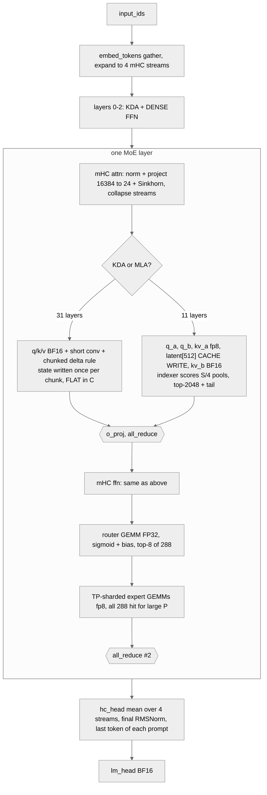

# GLM-5.3 Flash — Working Design Note

**Predicted execution model for Z.ai GLM-5.3 Flash on a 4×GB200 tray, TP4, FP8**

Built from the model repo's own files at revision
`eb9eb208eb0d988989d07a6a12d0fdeb5f52574a` of `zai-org/GLM-5.3-Flash`: `config.json`,
`model.safetensors.index.json`, the safetensors header of
`model-00002-of-00062.safetensors` (real dtypes and shapes for layers 0 and 1, both
KDA, and layer 45, the MTP layer with MLA and its indexer) and `README.md`. The
model repo ships no modeling code, so the code side is
`huggingface/transformers` @ `7cd73d9df0c14b151c684b708a9f27d8d0349dfe`,
`models/glm5_next/configuration_glm5_next.py` and `modeling_glm5_next.py`. The
deployment shape is the vendor's published vLLM recipe. **No traces.** Every
planner number is a roofline floor at vendor peak: a lower bound on time, not a
target.

Tags used throughout: **[ENGINE]** an assumption about the serving engine,
**[HW]** a hardware figure not in the planner's own tables, **[INFER]** a shape not
in the header sample, confirmed only by the exact byte closure in §1. Untagged numbers are read from the
files above or re-derived from them by hand.

**No family in the planner fits this model** (§7, G1). The catalogue entry
`gitm/planner/models/glm-5.3-flash.yaml` uses `glm_moe_dsa` as the closest fit and
prices all 45 layers as MLA. Where planner output and the hand ledger differ, both
are shown and §7.2 says why. This is the same gap as Kimi K3 (KDA linear attention
mixed with MLA) and the analysis there applies directly.

Reproduce any figure here (against HEAD `7450b93` plus the new entries, the only
state these outputs were produced on):

```bash
gitm plan glm-5.3-flash --gpu GB200 --batch 32 --kv-len 8192 --tp 4
gitm plan glm-5.3-flash --gpu GB200 --batch 32 --kv-len 8192 --tp 4 --spec-tokens 5
gitm plan glm-5.3-flash --gpu GB200 --prefill-tokens 8192 --batch 0 --kv-len 0 --tp 4
gitm plan glm-5.3-flash --gpu GB200 --sweep 1,4,16,32,64,128,256 --kv-len 8192 --tp 4
```

## Hardware assumption: 4×GB200 (one tray), NVLink, TP4, FP8 weights and KV

**This one is the vendor's own**: `recipes.vllm.ai/zai-org/GLM-5.3-Flash` (vLLM
0.29.0+) publishes it for a GB200 tray. If production differs, graph topology does not change, only these
constants and some bound labels do. Regions whose label would flip are marked ⚑.

| Constant             | Value used              | Note |
| -------------------- | ----------------------- | ---- |
| BF16 tensor peak     | **2,250 TFLOP/s**       | `gitm/planner/context.py`, GB200 |
| FP8 tensor peak      | **4,500 TFLOP/s**       | same |
| FP4 tensor peak      | **9,000 TFLOP/s**       | same, unused here |
| FP32 peak            | **19.5 TFLOP/s**        | ⚠ **no GB200 fp32 entry exists**, so this is the A100 dataclass default. It sets the router's cost (§4.2, §7 G4) |
| HBM                  | **8.00 TB/s**           | `context.py` |
| NVLink               | **1,800 GB/s** per GPU  | `context.py` |
| Memory               | 186 GB per GPU [HW]     | not in `context.py` |
| Usable memory        | 0.90 × 186 = 167.4 GB   | [ENGINE] vLLM default `gpu_memory_utilization` |
| Kernel launch        | 2 µs                    | the planner's launch floor, CUDA-graph replay ⚑ |

The recipe, verbatim, because every constant above and every bound label in §4
assumes it:

```bash
vllm serve zai-org/GLM-5.3-Flash --tensor-parallel-size 4 --kv-cache-dtype fp8 --speculative-config '{"method":"mtp","num_speculative_tokens":5}' --tool-call-parser glm47 --reasoning-parser glm47 --enable-auto-tool-choice --served-model-name zai-org/GLM-5.3-Flash
```

`--enable-expert-parallel` is **not** in it, so experts are TP-sharded four ways
and there is no all-to-all. The recipe also says about 306 GiB of weights for the
native FP8 checkpoint. `total_size` is 305.78 GiB. They agree.

```
FP8  ridge = 4,500e12 / 8.0e12 = 562 FLOP/byte
BF16 ridge = 2,250e12 / 8.0e12 = 281 FLOP/byte
FP32 ridge =    19.5e12 / 8.0e12 =   2 FLOP/byte   (fallback, see G4)
```

**You need all three.** Experts, dense FFN and four MLA projections are FP8. KDA,
`kv_b_proj`, the indexer, `lm_head`, `embed_tokens` and `eh_proj` are BF16. The
router is FP32 at run time.

---

## 1. Layer-by-layer architecture map

### Headline structure

| Property                    | Value |
| --------------------------- | ----- |
| Layers                      | **45** transformer + **1** MTP layer (`layers.45`) |
| Attention                   | **34 KDA linear-attention layers + 11 MLA layers**, 0-indexed, MLA where `i % 4 == 3` (3, 7, ..., 43) |
| KDA                         | 64 heads × 128, q/k/v each 8192 wide, low-rank decay (`f_a`/`f_b`) and output gate (`g_a`/`g_b`), rank 128, fixed fp32 state |
| MLA                         | 64 heads, q_lora 1536, kv_lora 512, nope 256, **rope 0**, v 256, **no output gate** |
| KV latent                   | `kv_lora_rank=512` + `qk_rope_head_dim=0` = **512 elems/token/MLA layer** |
| Indexer                     | 32 heads × 128, **IndexPool 4** (four keys pooled into one), top-2048, on all 11 MLA layers and on the MTP layer |
| Dense MLP                   | **3**, layers 0, 1, 2 (`first_k_dense_replace: 3`), `intermediate=12288` |
| MoE layers                  | **42**, layers 3–44, plus the MTP layer |
| Experts / top-k             | 288 routed, top-8, **1 shared**, `moe_intermediate_size=2048` |
| Routing                     | sigmoid, `noaux_tc`, `norm_topk_prob`, `routed_scaling_factor=2.5`, **fp32 router cast** |
| Residual                    | **mHC**, 4 streams of 4096, two `[24, 16384]` projections per layer, 20 Sinkhorn iterations |
| hidden_size                 | 4096 |
| Vocab                       | 154,880, untied `lm_head` |
| Max context                 | 1,048,576 |
| Vision                      | 24-block ViT, hidden 1024, merger to 4096 |
| Total / active params       | **320.76 B** text incl. MTP / **16.74 B** active (README says 320 B / 18 B, C14) |

**Where the Kimi K3 analysis applies directly.** Both mix KDA with MLA on a 3:1
schedule and both hit the same planner gap (§7 G1). Differences: the layer lists
are 0-indexed here (K3's were 1-indexed), MLA here has no output gate and no RoPE,
there is a DSA indexer with IndexPool, there is mHC instead of Attention
Residuals, and there is no LatentMoE, so the entry needs no stand-in fields.

### Semantics read from the checkpoint, not guessed

**Precision is read from a real header**, shard 00002:

| dtype | tensors |
|---|---|
| F8_E4M3 + F32 `weight_scale_inv` (128×128) | routed and shared experts, dense FFN, MLA `q_a_proj`, `q_b_proj`, `kv_a_proj_with_mqa`, `o_proj` |
| BF16 | all KDA projections and convs, `kv_b_proj`, whole indexer, `mlp.gate.weight`, `hc_*_fn`, norms |
| F32 | `A_log`, `dt_bias`, `e_score_correction_bias`, `hc_*_base`, `hc_*_scale` |

**The indexer schedule is proven from the weight map, not from `indexer_types`.**
Indexer tensors exist on exactly the 11 MLA layers and on layer 45, and on none of
the 34 KDA layers. `config.json` says 45 × `"full"` (C3). The entry follows the
weight map.

Tensor counts from the index: `self_attn.A_log` 34, `kv_b_proj.weight` 12 (11 +
MTP), `indexer.wk.weight` 12, `mlp.gate.weight` 43 (42 + MTP), routed
`gate_proj.weight` 12,384 = 43 × 288, `weight_scale_inv` 37,338, total 76,108 in
62 shards.

**Config versus code, every contradiction found, stated as found and not
resolved here:**

| # | Contradiction | Where | Consequence |
|---|---|---|---|
| **C1** | 34 KDA + 11 MLA. No planner family has a recurrent layer kind with MLA. Same gap as Kimi K3 C1 | `layer_types` against `model_catalogue._FAMILIES` | entry latent KV ×4.09, state absent, KDA weights −5.37 GB (§7.2) |
| **C2** | `layer_types` uses `"deepseek_sparse_attention"`. The config class documents `"indexed_attention"` and `__post_init__` maps only `"full_attention"` to it. `causal_mask_mapping` has keys `"indexed_attention"` and `"linear_attention"` only (modeling line 1490) | config.json against configuration and modeling at 7cd73d9 | `causal_mask_mapping[self.config.layer_types[i]]` raises KeyError on layer 3 when this config is loaded as-is (read from code, not run). Construction still works because it only tests `== "linear_attention"` |
| **C3** | `indexer_types` lists 45 × `"full"`. The weight map has indexer tensors on only the 11 MLA layers and the MTP layer | config against index | the code reads `indexer_types` only inside MLA attention, so the 34 KDA entries are dead. The entry uses the weight-map schedule |
| **C4** | `index_share_for_mtp_iteration: true`, yet layer 45 ships its own full indexer (14.9 MB). No code reads the key. In GLM-5.2 the MTP layer carried no indexer | config against index and code | whether the MTP indexer runs is unknown. The entry follows the config and omits it |
| **C5** | `num_nextn_predict_layers: 1` and layer 45 is in the index. The code sets `_keys_to_ignore_on_load_unexpected = [r"layers\.45\.", ...]`, so it drops MTP on load. The layer number is hard-coded | config against modeling line 1380 | the cited code cannot run MTP. The recipe's MTP D=5 runs engine code nobody has cited |
| **C6** | `modules_to_not_convert` names per-layer modules as `model.layers.N.*`. Checkpoint and code use `model.language_model.layers.N.*`. It also lists names found in neither: `fused_qkvbfg_a_proj`, `qkv_proj`, `attn_mha`, `attn_mqa`, `mapping_proj`, `hyper_connection`, `router` | quantization_config against index and code | the header shows the intended result (KDA, kv_b, indexer bf16). Whether a loader's matcher hits these entries is loader-specific. A literal matcher would try to load bf16 KDA weights as FP8 |
| **C7** | Checkpoint stores `q_conv1d`, `k_conv1d`, `v_conv1d` separately. The code has one `conv1d` of 3 × 8192 channels. Also `hc_attn_fn` against `attn_hc.fn`, `self_attn.f_a_proj` against `self_attn.forget_gate.f_a_proj`, and per-expert 2D `gate/up/down_proj` against a 3D `gate_up_proj` | index against modeling | a conversion mapping must exist outside the cited files. UNVERIFIED |
| **C8** | `mhc`, `mla_use_nope`, `moe_router_dtype`, `index_kpool_compress`, `index_share_for_mtp_iteration`, `scoring_func`, `topk_method` and `indexer_rope_interleave` are set in config.json and read by neither code file. Behaviour is hard-coded: mHC always on, NoPE via rope 0, fp32 router cast, pooling always compressed | config against code | consistent today by accident. Editing any of them changes nothing |
| **C9** | `head_dim: 0` is popped and overwritten with `qk_rope_head_dim`. `linear_attn_config.kda_layers` and `full_attn_layers` are never read. The schedule comes from `layer_types`. Same key names as Kimi K3, but 0-indexed here and 1-indexed there | configuration `__post_init__` | a reader that reuses K3's convention shifts every layer by one |
| **C10** | `_tied_weights_keys` maps `lm_head.weight` to `embed_tokens`, while `tie_word_embeddings: false` and the checkpoint ships a separate 1.27 GB `lm_head.weight` | modeling line 2127 against config and index | tying should apply only when the flag is true. UNVERIFIED for this transformers version |
| **C11** | Router stored bf16 `[288, 4096]`. `moe_router_dtype: float32`, and the code casts weight and input to fp32 | header against config and code | entry prices it fp32, which overstates stored bytes by 101.4 MB |
| **C12** | `conv1d` is in `_keep_in_fp32_modules_strict`, but the conv weights are stored bf16 | modeling line 1379 against header | 98 KB per layer. Minor |
| **C13** | `validate_architecture` requires `num_key_value_heads == num_attention_heads` (64) on a model with no GQA layer | configuration | a reader that multiplies it by head_dim overstates MLA KV 64× |
| **C14** | README says 18B active. Re-derived 16.74B, or 17.38B with the input embedding | README against the verification below | not reproduced. The counting convention is unknown |
| **C15** | The family has no IndexPool. It scans S raw index keys and caches `index_head_dim` per token. The model scores S/4 pooled keys, and the reference caches 257 channels per token | glm_graph against modeling | index bytes in the planner are wrong in either direction depending on the engine. §5 rank 1 |

Attention shapes, per token per layer, from the header:

| Quantity | Shape | Purpose |
|---|---|---|
| KDA q, k, v | 3 × 8192 | 64 heads × 128, each through its own short conv (k=4) |
| KDA decay, output gate | 4096 → 128 → 8192, twice | low-rank, per-channel |
| KDA state | 64 × 128 × 128, fp32 | **fixed per sequence, no KV cache** |
| MLA Q latent (`q_a`) | 1536 | replicated low-rank query |
| MLA Q per-head (`q_b`) | 64 × 256 = 16,384 | all nope, no rope |
| **MLA KV cache entry** | **512** | one latent for all 64 heads, no RoPE key |
| `kv_b` output | 64 × (256+256) = 32,768 | reconstructed K and V |
| After `o_proj` | 4,096 | back to `d_model` |
| Index key | 128 per token, pooled 4 → 1 for scoring | cached alongside the latent on MLA layers |

`num_key_value_heads: 64` is a **red herring** (C13).

### The 46-row table, collapsed to four archetypes

| Archetype | Count | Attn | Indexer | MLP | Cache per token | Collectives per layer (TP4) |
| --------- | ----- | ---- | ------- | --- | --------------- | --------------------------- |
| `Lk,d` | **3** | KDA | none | dense 12288 | none (fixed state) | 2× all-reduce |
| `Lk,s` | **31** | KDA | none | MoE 288×2048 | none (fixed state) | 2× all-reduce |
| `Lm,s` | **11** | MLA+DSA | **full**, IndexPool 4 | MoE 288×2048 | 512 latent + index key | 2× all-reduce |
| `Lmtp` | **1**, ×D | MLA+DSA | own indexer (C4) | MoE 288×2048 | 512 latent | 2× all-reduce per stage |

3 + 31 + 11 = **45**. The planner sees a different four: `Ld,sh` ×3, `Ls,sh` ×31,
`Ls,f` ×11 and `Lmtp`, all MLA (Appendix A.5). No sliding window, no compression
schedule. The absences that matter are the KV cache on 34 of 45 layers and any
RoPE at all.

### Verification — three independent checks

| check | predicted | published | error |
| --- | --- | --- | --- |
| stored bytes, by hand from header shapes | 328,326,771,576 B | 328,326,771,576 B (62 shards) | **0 B** |
| tensor count | 87 + 19,382 + 54,529 + 1,760 + 3 + 347 = 76,108 | 76,108 | **exact** |
| `weight_scale_inv` count | 9 + 48 + 37,152 + 129 = 37,338 | 37,338 | **exact** |
| params, text incl. MTP | **320.76 B** | 320 B (README) | +0.2 % |
| active params | 16.74 B (17.38 B with embed) | 18 B (README) | not reproduced (C14) |
| recipe weight size | 305.78 GiB | "about 306 GiB" | agrees |

The byte closure, per unit (shapes from the shard 00002 header for layers 0, 1
and 45, other layers of the same kind assumed identical [INFER]):

| Block | Per unit | Units | Total |
|---|---:|---:|---:|
| KDA attention: q/k/v/o 268,435,456 + f_a,g_a 2,097,152 + f_b,g_b 4,194,304 + b_proj 524,288 + convs 196,608 + o_norm 256 + A_log 256 + dt_bias 32,768 | 275,481,088 | 34 | 9,366,356,992 |
| MLA + indexer: fp8 q_a/q_b/kv_a/o 100,663,296 + F32 scales 24,576 + kv_b bf16 33,554,432 + norms 4,096 + indexer bf16 14,943,744 | 149,190,144 | 11 | 1,641,091,584 |
| mHC (2 × fn, base, scale) + 2 layer norms | 1,589,464 | 45 | 71,525,880 |
| dense FFN, fp8 + scales | 151,031,808 | 3 | 453,095,424 |
| MoE: 288 routed + 1 shared (25,171,968 each), router bf16, bias F32 | 7,277,059,200 | 43 | 312,913,545,600 |
| MTP: MLA + indexer, `eh_proj` [4096, 8192] bf16 [INFER], 5 norms | 216,339,968 | 1 | 216,339,968 |
| embed + lm_head + final norm | | | 2,537,562,112 |
| **text sum** | | | **327,199,517,560** |
| vision tower + merger, bf16, 347 tensors [INFER shapes]: 24 blocks × 16,792,704 + patch embed 1,205,248 + post norm 1,024 + downsample 16,781,312 + merger 142,614,528 = 563,627,008 weights | | | 1,127,254,016 |
| **total** | | | **328,326,771,576** |

**Residual 0 B.** An exact zero means the [INFER] shapes are almost certainly
right. It does not prove them.

### KV cache — the number that drives decode

```
per token, per GPU (the MLA latent is replicated across TP ranks) [ENGINE]:
  MLA latent, 11 layers + MTP, fp8        12 × 512            =  6,144 B/token
  index keys, reading A (pooled fp8)      12 × 132 / 4        =    396 B/token
  index keys, reading B (reference code)  12 × 514            =  6,168 B/token
  KDA layers                               none per token

per sequence, per GPU, fixed:
  KDA state  34 × 16 heads × 128 × 128 × 4 B (fp32)  = 35,651,584 B
  KDA conv   34 × 6,144 ch × 3 × 2 B                  =  1,253,376 B

the planner entry, all 45 layers as MLA, MTP not counted:
  45 × 512 × 1.000244 + 11 × 128 × 1.000244           = 24,453.97 B/token
```

Reading A is an engine choice [ENGINE]: pooled fp8 keys, 128 B plus a 4 B scale,
one per 4 tokens. Reading B is what `modeling_glm5_next.py` does: it caches 257
bf16 channels per token (key 128, compress gate 128, valid flag 1) and re-pools
every step. The files support both (§8.1 Q2).

| Context | hand, reading A | hand, reading B | planner entry |
| ------- | --------------- | --------------- | ------------- |
| 8,192 | 0.09 GB | 0.14 GB | 0.20 GB |
| 131,072 | 0.89 GB | 1.65 GB | 3.21 GB |
| 1,048,576 | **6.89 GB** | **12.95 GB** | **25.64 GB** |

Sequences at 1M in the 84.08 GB left per GPU after weights (§4.1): **12** under
reading A, **6** under reading B, **3** by the entry. These are sequences per 4-GPU
replica, because the latent is replicated.

### FP8 — what is and is not quantized

| Component | Precision | Evidence |
| --- | --- | --- |
| experts (routed, shared), dense FFN | **FP8 e4m3**, 128×128 block | header |
| MLA `q_a`, `q_b`, `kv_a`, `o_proj` | **FP8 e4m3**, 128×128 block | header |
| MLA `kv_b_proj` | **BF16** | header. Named in `modules_to_not_convert` |
| all KDA projections and convs | **BF16** | header. Named in `modules_to_not_convert` (under the wrong prefix, C6) |
| indexer `wq_b`, `wk`, `weights_proj`, `k_norm`, compress gate and ape | **BF16** | header |
| `lm_head`, `embed_tokens`, MTP `eh_proj` | **BF16** | `modules_to_not_convert` and the byte closure |
| router `mlp.gate.weight` | **BF16** stored, **FP32** at run time | header, `moe_router_dtype`, code cast (C11) |
| mHC `hc_*_fn` / `hc_*_base`, `hc_*_scale` | BF16 / F32 | header |

**Every KDA weight is outside the quantised set.** The 34 layers that own most of
the attention weights are BF16, so at low batch the checkpoint moves more BF16
bytes than FP8 bytes outside the experts (§5 rank 3).

---

## 2. Per-phase execution diagrams

### 2.1 Prefill — a chunk of P tokens against C cached



With 288 experts and top-8, a chunk of P tokens issues `8P` assignments, so once P
is a few hundred every layer reads its whole expert bank. The planner prices that
at 10.9 ms per pass (§4.2). The planner's prefill top line is not the experts,
though: it is the **router at the fp32 fallback peak**, 41.7 ms and 54.4 % of the
pass, which is a planner artifact (G4), not a model fact.

**KDA inverts the MLA story.** The 34 KDA layers do chunked delta-rule work that is
linear in P and flat in C. Only the 11 MLA layers see C at all, and there the
quadratic is in the indexer scan over S/4 pools, not the core.

### 2.2 Decode — steady state, B sequences, one token each

| operator | prefill class | decode class | why the class changes |
| --- | --- | --- | --- |
| KDA core | chunked delta rule, compute | recurrent update, **memory**: read and write 64×128×128 fp32 per head-shard per sequence | one row per sequence against a fixed state |
| MLA core | tiled, top-2048 per query | paged decode over ≤2,051 selected entries | one query row per sequence |
| indexer scan | `O(P·C/4)` pools, compute | `O(B·C/4)` under reading A, `O(B·C)` under reading B, **memory** | the query count collapses, the key set does not |
| every GEMM | M = P, compute | M = B, weight-streaming | same kernel, different regime |
| `lm_head` | one row per request | every row, every step | the epilogue is free in prefill and not in decode |

```
  [4 mHC streams, B×4×4096]
        │
   mHC attn: norm, [24,16384] BF16 projection, 20 Sinkhorn iters ─▶ collapse to B×4096
        │
   ┌────┴───────────────────────────────────────────────┐
   │ KDA layer (34 of 45)?                               │
   │   yes → q/k/v/o, gates BF16, conv update,           │ ← flat in S. 36.9 MB state
   │         recurrent update of fp32 state              │   read+write per seq per GPU
   │   no  → MLA: q_a/q_b/kv_a fp8, kv_b BF16,           │
   │         indexer BF16 scores the history,            │ ← the ONLY term that grows with S
   │         core over ≤2,051 selected latents           │
   └────┬───────────────────────────────────────────────┘
        │
   o_proj, all_reduce #1 ··································· latency-bound
        │
   mHC ffn, router GEMM FP32, sigmoid+bias, top-8 of 288
        │
   TP-sharded expert GEMMs fp8 ········ about 171/288 woken at B=32, 1.08 GB/layer/GPU
        │
   all_reduce #2
        ▼
   … ×45 layers, then hc_head mean, final RMSNorm, lm_head BF16, sample
```

### 2.3 Encoders — there is one, and no text step enters it

GLM-5.3 Flash is **natively multimodal**: a 24-block ViT (hidden 1024, 16 heads)
and a merger to 4096, 563.6 M weights and 1.127 GB BF16 in the byte closure. A text
decode step never enters it, so the planner does not price it and this note counts
it only as resident weight (§4.1). The encoder-to-backbone seam exists for image
requests and is **not modelled** (§7).

### 2.4 MTP-on decode — draft and verify

Verify is the decode graph at 1+D rows per sequence. The draft chain is the MTP
layer run D times. Per the weight map the MTP layer is `enorm` + `hnorm` +
`eh_proj` `[4096, 8192]` BF16 + one MLA block **with its own indexer** (C4) + **a
full 288-expert MoE**, and it carries **no mHC tensors** and no `lm_head` of its own.
As in GLM-5.2, the draft is one full MoE layer, not a small dense copy.

Two differences from GLM-5.2. The draft has an indexer the config says it should
not use (C4), and the planner follows the config and omits it. And **the KDA state
must roll back** on rejected drafts, which needs per-position state checkpoints or
recompute (§8.1 Q5). The planner prices neither.

---

## 3. Predicted execution graph

The 46 blocks collapse to four archetypes (§1). All planner figures at **B=32,
S=8192, TP4, FP8 weights and KV, per GPU** unless stated. Per-node tables are in
Appendix A.

### 3.1 Prologue and epilogue

| id | operator | kernel class | t (µs) | bytes | bound |
| --- | --- | --- | --- | --- | --- |
| D0 | `embed_tokens` | gather | 2.00 | ~0 | launch |
| E0 | `rms_norm` | final norm (after the `hc_head` mean, not priced) | 2.00 | ~1 MB | launch |
| E1 | `lm_head` | GEMM BF16, vocab-sharded ÷4 | 40.0 | 320 MB | memory |
| E2 | `logits_all_gather` | all-gather across 4 ranks | 8.0 | 64 MB | memory |

The `hc_head` stream mean is not a planner node (§7 G3).

### 3.2 What prefill changes

At P = 8,192 in one chunk (planner, `glm_prefill`):

| Prefill, P=8192, C=0, TP4, per GPU | value |
| --- | --- |
| predicted floor | **76.626 ms** (106,909 tok/s) |
| nodes | 869, 337 compute-bound, 44 launch-bound |
| top line | `moe_router` **41.712 ms, 54.4 %**, compute at the fp32 fallback |
| experts | `moe_routed` 10.924 ms, 14.3 %, memory (AI 396 against ridge 562) |
| collectives | 2 × 2.517 ms all-reduce, memory |

**The router line is the fallback peak, not the model.** 42 router GEMMs at
2 × 8192 × 4096 × 288 = 811.7 GF over 19.5 TF/s is 41.6 ms. At the BF16 peak the same
FLOPs take 0.36 ms and the node becomes memory-bound at about 0.45 ms, which would
put the prefill floor near **35.5 ms**. GB200's real fp32 rate is not in the
planner's tables and is not stated here (G4, Q4).

Chunking is not pinned by the recipe. The figures above assume one chunk (§8.1 Q8).

### 3.3 MTP — the whole-step economics

At B=32, S=8192, D=5 (planner, `glm_mtp`):

| pass | nodes | floor |
| --- | ---: | --- |
| vanilla decode (D=0) | **869** | 7.569 ms |
| MTP step (D=5) | **979** | **13.448 ms** |

Cost ratio **1.777×** for up to 6 tokens. Where the extra 5.879 ms goes:

- `moe_routed` +4.521 ms (5.658 → 10.179 ms, 42 → 47 instances). The verify pass at
  192 rows wakes nearly the whole bank.
- `moe_router` +0.842 ms, mostly the fp32 fallback at 6× the rows (G4).
- `lm_head` +0.202 ms (1 → 6 instances), `mtp_eh_proj` 0.042 ms.

Break-even on a prefix chain, `Σ αⁱ = (1−α⁶)/(1−α) = 1.777`:

| α | 0.0 | 0.5 | 0.7 | 0.9 | break-even |
| --- | --- | --- | --- | --- | --- |
| accepted tokens/step | 1.000 | 1.969 | 2.941 | 4.686 | **1.777** |
| tok/s = `32 × Σαⁱ ÷ 13.448 ms` | 2,380 | 4,685 | 6,999 | 11,150 | **α ≈ 0.44** |
| MTP off = `32 ÷ 7.569 ms` | 4,228 | 4,228 | 4,228 | 4,228 | n/a |

**The hand ledger at S=131,072** (§4.1) gives verify plus five drafts at about
91.5 GB against 53.3 GB, 1.72×, break-even **α ≈ 0.42**. The two agree on the
shape: at B=32 MTP D=5 needs more than about 0.42–0.44 acceptance to pay. α is a
serving observable this graph does not predict (Q3).

⚑ At B=1 the step is launch-bound (§4.1), and the sign of the MTP decision flips
with batch.

### 3.4 Predicted synchronization points

| # | Where | Kind | conf | Trace signature if real |
| --- | --- | --- | --- | --- |
| **S1** | after the gating kernel | host readback of the expert histogram | low | 42 D2H per decoded token. Blocks graph capture |
| S2 | around each all-reduce | stream event wait | medium | 90 event pairs per step (2 × 45) |
| S4 | sampling | D2H of sampled ids | high | one per step, unavoidable |
| S6 | after each draft `argmax` | D2H ×D | medium | 5 extra D2H per step |
| S7 | verify accept/reject | host-visible variable length | high | a small kernel + D2H whose value decides the advance |
| S8 | KV rollback | discard rejected rows | low | pointer rewind or memmove |
| **S8b** | **KDA state rollback** | restore the recurrent state to the last accepted position | **low** | per-position state copies or a recompute kernel after verify. New with KDA, absent in GLM-5.2 |

GLM-5.2's S9 (IndexShare handoff) has no counterpart here: every MLA layer runs
its own indexer, so no selection crosses layers.

---

## 4. Execution-bound / roofline hypotheses

Labels are against peak. Every row names its precision.

### 4.1 Decode as a node table — B=32, S=8192, TP4, FP8, per GPU

Planner, `glm_decode`. Ridge 562 (fp8), 281 (bf16), 2 (fp32 fallback). Launch
floor 2 µs. Per-node shapes in Appendix A.1.

| node | ×N | Σ ms | bound | share |
| --- | ---: | ---: | --- | ---: |
| `moe_routed` | 42 | **5.658** | memory | **74.8 %** |
| `moe_router` (GEMM + gating) | 84 | 0.247 | compute/launch | 3.3 % |
| `attn_score_value` | 45 | 0.189 | memory | 2.5 % |
| `rms_norm` · `act_quant` | 91 · 90 | 0.182 · 0.180 | launch | 2.4 % each |
| `attn_out_proj` | 45 | 0.097 | memory | 1.3 % |
| 11 more node types at the launch floor | 45 or 42 each | 0.084–0.090 each | launch | 1.1–1.2 % each |
| `attn_index_score` | 11 | 0.046 | memory | 0.6 % |
| `lm_head` · `logits_all_gather` | 1 · 1 | 0.040 · 0.008 | memory | 0.6 % total |
| **869 nodes** | | **7.569** | | **4,228 tok/s** |

| facet | nodes |
| --- | ---: |
| memory | 148 |
| launch | 679 |
| compute | 42 (the router GEMMs, at the fp32 fallback) |

**The planner and the hand ledger agree on the expert term** (45.26 GB against
45.22 GB per GPU per step) and disagree elsewhere for known reasons (§7.2).

**The batch story** (planner, `glm_sweep`):

| B | floor | tok/s | compute-bound |
| --- | --- | --- | --- |
| 1 | 1.964 ms | 509 | 0/869 |
| 4 | 2.715 ms | 1,474 | 0/869 |
| 16 | 5.164 ms | 3,098 | 0/869 |
| 32 | 7.569 ms | 4,228 | 42/869 |
| 64 | 10.278 ms | 6,227 | 42/869 |
| 128 | 12.420 ms | 10,306 | 42/869 |
| 256 | 14.337 ms | 17,856 | 42/869 |

**Below B≈16 the step is launch-bound in memory-bound clothes.** At B=1 the
planner floor is 1.964 ms against a hand memory floor of 0.75 ms. The difference
is the 2 µs floor on most of 869 nodes, which already assumes CUDA-graph replay ⚑.

**Per-GPU ledger, by hand.** Deployment as in the hardware section, plus these
[ENGINE] assumptions: the MLA latent, `q_a`, `kv_a`, the indexer, the router, mHC,
the vision tower and `eh_proj` are replicated. KDA state is fp32 (the code casts it,
`update_recurrent_state(... .to(torch.float32))`). KDA conv state is bf16. Routing
is uniform, distinct experts = E(1 − (1 − k/E)^B), E 288, k 8.

Resident weights, per GPU:

| Row | Bytes per GPU |
|---|---:|
| routed + shared experts, fp8, ÷ 4 | 78,203,011,584 |
| KDA, bf16, ÷ 4 | 2,341,589,248 |
| MLA × 12 (q_a, kv_a, norms replicated, rest ÷ 4) | 478,291,968 |
| indexer × 12, replicated | 179,324,928 |
| router × 43, replicated | 101,499,264 |
| mHC + layer norms, replicated | 71,525,880 |
| dense FFN ÷ 4 | 113,273,856 |
| embed + lm_head ÷ 4 | 634,388,480 |
| MTP `eh_proj` + norms, replicated | 67,149,824 |
| final norm | 8,192 |
| vision, replicated | 1,127,254,016 |
| **total** | **83,317,317,240 (83.32 GB)** |

Left for KV, state and activations: 167.4 − 83.32 = **84.08 GB**. Activations are
not counted, so every capacity is an upper bound.

Decode step bytes, per GPU, memory floor only (no launch, no collectives, no MTP):

| Term | B=1, S=8,192 | B=32, S=8,192 | B=32, S=131,072 |
|---|---:|---:|---:|
| non-expert weights (KDA 2.34 GB of it) | 3.810 GB | 3.810 GB | 3.810 GB |
| routed experts (8 / about 171 distinct per layer, ÷ 4) | 2.114 GB | 45.217 GB | 45.217 GB |
| MLA read, 11 × 2,051 selected × 512 B | 0.012 GB | 0.370 GB | 0.370 GB |
| indexer scan, reading A | 0.003 GB | 0.095 GB | 1.523 GB |
| KDA state read + write | 0.074 GB | 2.362 GB | 2.362 GB |
| **total, reading A** | **6.01 GB** | **51.85 GB** | **53.28 GB** |
| floor at 8 TB/s | 0.75 ms | 6.48 ms | 6.66 ms |
| indexer scan, reading B instead | 0.046 GB | 1.482 GB | 23.715 GB |
| **total, reading B** | 6.06 GB | 53.24 GB | 75.47 GB (9.43 ms) |

Largest terms: at B=1 non-expert weights are 63 % and KDA weights alone 39 %. At
B=32 under reading A the routed experts are 85 %. At B=32, S=128K under reading B
the indexer scan is 31 %.

### 4.2 Prefill and MTP — regions and what flips them

| Phase | Region | Bound | Why | Precision / peak | Flip variable |
|---|---|---|---|---|---|
| **Pre** | router GEMM ×42 | **compute** | 811.7 GF at the **fp32 fallback 19.5 TF/s** → 41.7 ms = **54.4 %** | ⚠ FP32, no GB200 entry | ⚑ a real fp32 peak, or a bf16 GEMM with fp32 accumulate (G4, Q4) |
| **Pre** | expert GEMMs ×42 | memory | AI 396 against the fp8 ridge 562, 10.9 ms = 14.3 % | FP8 block-scaled | chunk size, imbalance |
| **Pre** | all-reduce ×90 | comm, bandwidth | 2 × 2.517 ms | BF16 payload | P |
| **Pre** | projections, attention core | compute | `attn_out_proj` AI 1,820, `q_a`/`q_b` 1,046 | FP8 | P |
| **Pre** | indexer scan ×11 | compute | AI 262,112, 1.3 ms | BF16 math | P **and** C |
| **Pre** | KDA chunked delta rule ×34 | **not priced** | the planner prices these layers as MLA | BF16 / FP32 state | a family with a recurrent kind (G1) |
| **MTP** | verify experts | memory | 42 → 47 `moe_routed`, 5.658 → 10.179 ms | FP8 | B(1+D) against E=288, D |
| **MTP** | draft `lm_head` ×5 + `eh_proj` ×5 | memory | 0.202 + 0.042 ms | BF16 | D |
| **MTP** | KDA state rollback | **not priced** | per-position checkpoints or recompute | FP32 | engine (Q5) |
| **MTP** | whole step | ⚑ memory above B≈16, launch below | **1.777×** for ≤6 tokens, break-even α ≈ 0.44 | mixed | graph capture, B, α, D |

### 4.3 Flip-variable index

| Flip variable | Direction and magnitude |
| --- | --- |
| **Decode batch B** | expert bytes are sub-linear: 8 distinct at B=1, about 171 at 32. 509 → 17,856 tok/s across 1→256 |
| **Sequence length S** | moves the MLA indexer scan and nothing else in the model. The planner also grows KV storage on 45 layers where 11 is right |
| ⚑ **Index key layout** | reading A against B: **2.9×** on the step floor at S=1M, B=8, and 12 against 6 sequences at 1M (§5 rank 1) |
| ⚑ **CUDA-graph capture** | the B=1 floor is 1.964 ms planner against 0.75 ms memory. Eager launches make it worse |
| **D and α** | 1.777× at D=5, break-even α ≈ 0.44 (planner, S=8K) or 0.42 (hand, S=128K) |
| ⚑ **Router GEMM precision / fp32 peak** | 41.7 ms of a 76.6 ms prefill rests on the fallback |
| **KV dtype** | fp8 against bf16 doubles the latent and moves 1M capacity |

---

## 5. Ranked headroom hypotheses

Ranked by expected recoverable time × confidence. All are hypotheses from the
ledger, not measurements.

| Rank | Region | Prediction | Why | Evidence to inspect | What would prove it wrong |
|---|---|---|---|---|---|
| **1** | **Index key layout at long context** | at S=1M, B=8 the indexer scan is **47.4 GB per GPU per step under reading B, 70 % of the step**, against 3.0 GB under reading A. The floor moves from about 67 GB to about 23 GB, **2.9×**. Capacity at 1M moves from 6 to 12 sequences | the reference code re-pools 257 bf16 channels per token every step. An engine that caches pooled fp8 keys reads about 16× less | vLLM's GLM-5.3 indexer: cached layout and whether pooled keys are cached. DRAM bytes on the indexer kernel against S × 514 B × 11 | measured indexer bytes near S/4 × 132 B × 11. Then the engine already does reading A |
| **2** | **MTP D=5 at serving batch** | at B=32 verify has 192 rows and wakes 287 of 288 experts per layer against 171 without MTP. Verify plus five drafts is **1.72×** by hand (S=128K) and **1.777×** by the planner (S=8K). Break-even α ≈ 0.42–0.44. Below it MTP costs throughput at this batch | the expert union saturates. The draft is a full 288-expert MoE layer | `vllm:spec_decode_*` acceptance metrics. Bytes per step with and without MTP | production α well above 0.5 at batch 32 and up |
| **3** | **BF16 KDA projections at low batch** | all KDA weights stay BF16. At B=1 they are **2.34 of 6.01 GB**. FP8 KDA would cut the floor about **19 %** | the checkpoint leaves every KDA weight out of the FP8 set | GEMM dtypes for `self_attn` on KDA layers in a trace | the engine already quantises them, or accuracy rules it out. Off-checkpoint, so accuracy is a real risk |

### 5.1 Gate check

Every row maps to a category GitM can observe: memory traffic by kernel (1),
precision selection (1, 3), speculative-decoding economics (2).

### 5.3 Deliberately excluded — architectural, not recoverable

- **mHC weights.** 71.5 MB with norms. Its activation traffic is real but
  unpriced (§7 G3).
- **KDA state traffic.** 4.4 % of the step at B=32. It grows linearly with B and
  should be watched above B=128.
- **EP versus TP for experts.** A trade, not a loss, in the balanced case.
- **The draft chain's serial gaps and the accept/reject readback**, as in
  GLM-5.2 §5.3.

GLM-5.2's §5.2 (a paired fork between two ranks) has no counterpart here.

---

## 6. Validation plan

### 6.1 The classification rule — *unexpected ≠ recoverable*

Unchanged from GLM-5.2 §6.1 and applied as written. One addition: a gap between
verify and the next draft that scales with the number of KDA layers is the state
rollback (S8b), and whether it is recoverable depends on whether the engine
checkpoints or recomputes (Q5).

### 6.2 Capture plan — request these before anyone opens a timeline

| # | Capture | Why | What dies without it |
|---|---|---|---|
| **C1** | Decode, **B ∈ {1, 8, 32, 128}**, S fixed at 8k | the launch/memory crossover and the expert curve | ranks 2, 3 |
| **C2** | Decode, **S ∈ {8k, 131k, 1M}**, B fixed | separates the indexer scan and settles reading A or B | rank 1 |
| **C3** | Prefill, **P ∈ {512, 8192}**, chunked and unchunked | the router precision question and the chunk multiplier | §3.2 |
| **C4** | **MTP on and off** at identical B and S, **with the acceptance metric** | α, and KDA state rollback cost | rank 2 |
| **C6** | **The engine's launch arguments and version, as text** | KV dtype, D, TP/EP, graph capture, chunk size, router dtype, index cache layout | most of §4–§5 |

C5 (TP-only against EP) from GLM-5.2 is not needed first: the recipe has no EP.

### 6.3 Instrument map — three tools, three questions

As GLM-5.2 §6.3: `nsys` for gaps, syncs and launch counts, `ncu` for bytes per
kernel, CUPTI activity for cheap whole-run counts.

### 6.4 Trace triage — what to measure, in order

| # | Measure | Scope | Expected | Deviation → meaning |
|---|---|---|---|---|
| **0** | Launch args, as text | C6 | TP4, fp8 KV, D=5 | resolves Q2–Q8 before a timeline is opened |
| **1** | launches per step, `--cuda-graph-trace=node` | C1 | about 869 nodes decode, 979 with MTP | far off → the lowering here is wrong |
| **2** | `dram__bytes_read.sum`, MoE region | C1 | about 1.08 GB per layer per GPU at B=32, 45.3 GB per step | much lower → L2 residency or skew |
| **3** | `dram__bytes_read.sum`, indexer region, swept in S | C2 | reading A: 11 × S/4 × 132 B × B. Reading B: 11 × S × 514 B × B | settles rank 1 |
| **4** | KDA recurrent kernel bytes | C1 | 2 × 36.9 MB per sequence per GPU | much lower → bf16 state. Much higher → per-position checkpoints |
| **5** | router GEMM dtype and duration | C3 | fp32 if the code's cast is honoured | bf16 GEMM → §3.2's 41.7 ms line collapses |
| **6** | kernel-name coverage | C1 | KDA kernels (conv update, delta rule, gated norm) appear and map to no planner node | expected, G1. Anything else unmapped is a model-validity failure |

---

## 7. GitM planner gaps — and what this branch changed

Read against HEAD `7450b93`.

### 7.0 What the planner already gets right

The expert term: `moe_routed` prices 45.26 GB per GPU per step at B=32 against the
hand ledger's 45.22 GB, through the coupon-collector distinct-expert term. The fp8
block-scale constant 1.000244 B per weight matches the checkpoint's F32 128×128
scales exactly (the byte closure uses it). `indexer_types` and `mlp_layer_types`
are read verbatim, per-op precision covers the indexer, `kv_b`, `lm_head`,
`eh_proj` and the router, and the MTP chain is D stages deep with its own
`lm_head` per stage. `load_spec` gives `45 11 42` for layers, full-indexer layers
and sparse-MLP layers. The catalogue tests pass (206 passed across
`test_glm_graph.py`, `test_moe_graph.py`, `test_catalog_unify.py`).

### 7.1 The gaps GLM-5.3 Flash exposed

| # | What needs representing | Why the abstraction broke | The extension | Shipped? |
|---|---|---|---|---|
| **G1** | **KDA linear attention and MLA in one stack** (C1) | `hybrid` has linear layers but GQA and one weight width. `glm_moe_dsa` has MLA, the indexer and per-op precision but no recurrent layer kind. So all 45 layers are priced as MLA: latent KV ×4.09, KDA state absent, KDA weights −5.37 GB. Same gap as Kimi K3 | a family, or a per-layer attention kind in `glm_moe_dsa`, that holds KV-or-state per layer | **no**. a planner change outside a catalogue PR |
| **G2** | **IndexPool** (C15) | the family scans S raw keys and caches `index_head_dim` per token. The model scores S/4 pooled keys and the reference caches 257 channels | model the pooled scan once the engine layout is known (Q2) | **no**. modelling either reading now would be a guess |
| **G3** | **mHC** | four 4096-wide streams, two `[24, 16384]` projections and 20 Sinkhorn iterations per layer, and a stream mean before the final norm. No node exists | nodes for the HC projection, Sinkhorn and collapse | **no**. cost is a trace question |
| **G4** | **An fp32 peak for GB200** | `context.py` has no fp32 entry for GB200/B200, so `resolve_peak` returns the A100 default 19.5 TF/s without flagging a fallback. The router becomes 54.4 % of prefill and +0.842 ms of the MTP increment | add the vector fp32 rate for Blackwell, as G4 did for Hopper in GLM-5.2 | **no**. the figure is not in the cited files |
| **G5** | **Dense FFN priced at the weight width squared** | `model_weight_bytes`: line 366 sets `dense_ffn = n_dense * 3 * h * spec.intermediate_size * ww / tp` and line 399 multiplies `(n_attn * attn_per_layer + dense_ffn) * ww` again. With fp8 `ww` = 1 + 2⁻¹², that adds 452,984,832 × (2⁻¹² + 2⁻²⁴) = 27 × 4,097 = **110,619 B** here. On a bf16 entry it **doubles** the dense FFN | multiply once | **no**. it moves every entry with a dense FFN and needs its own commit and test updates |
| **G6** | **`eh_proj` in `model_weight_bytes`** | the graph prices `mtp_eh_proj` but the weight footprint omits it, 67.1 MB here with its norms | add the term | **no** |
| **G7** | **An MTP layer with its own indexer** (C4) | `index_share_for_mtp_iteration` is the only switch, and the checkpoint contradicts it | read the weight map | **no** |
| **G8** | **Per-op width in the weight footprint** | the `attn_kv_b` override reaches the graph but not `model_weight_bytes`, which prices every attention weight at `ww`. −0.201 GB here | consult `dtype_for` per attention matrix | **no** |
| **G9** | **The vision tower** | 1.127 GB resident, never priced, and the image seam is absent | out of scope for a text step | n/a |

### 7.2 The one that needed more than a table row

**G1: the planner and the hand ledger, side by side.** Stored bytes first.
Planner `model_weight_bytes` = **321,562,118,171 B**, against 328,326,771,576 B on
disk, −6,764,653,405 B (−2.060 %). It decomposes exactly:

| Cause | Bytes |
|---|---:|
| KDA priced as MLA, 34 layers | −5,372,404,736 |
| `kv_b_proj` bf16 priced as fp8, 12 layers (G8) | −201,326,592 |
| IndexPool gate and ape on 11 layers, plus the MTP indexer (G2, G7) | −26,494,976 |
| router priced fp32, stored bf16 | +101,400,192 |
| mHC and layer norms (G3) | −71,525,880 |
| MTP `eh_proj` and norms (G6) | −67,149,824 |
| final norm | −8,192 |
| vision (G9) | −1,127,254,016 |
| **dense FFN priced at `ww` squared (G5)** | **+110,619** |

The hand formula first gave 321,562,007,552 B. The planner prints 110,619 B more,
and G5 is exactly why. The YAML's provenance quotes the planner figure.

Then the decode step, B=32, S=8192, per GPU. The planner's memory terms sum to
6.318 ms, **50.54 GB**. The hand ledger (reading A) is **51.85 GB**. The 1.31 GB
decomposes:

| Cause (hand − planner) | GB |
|---|---:|
| KDA state read and write, absent in the planner | +2.362 |
| attention projections: hand 2.779 (KDA bf16 + MLA) against planner 1.880 (45 × MLA fp8) | +0.899 |
| mHC and norm weights, absent in the planner | +0.072 |
| attention core: hand 0.370 (11 layers) against planner 1.512 (45 layers) | −1.142 |
| activations the planner prices and the hand ledger does not (norms, quant, permute, combine, collectives) | −0.424 |
| indexer: hand 0.259 (pooled scan) against planner 0.528 (raw scan) | −0.269 |
| router at fp32 | −0.109 |
| experts, shared, dense, `lm_head` (activation terms) | −0.081 |
| **sum** | **+1.308** |

**The two errors partly cancel in the total, which is what makes them
dangerous.** The planner's decode floor lands within 3 % of the hand ledger while
missing the KDA state entirely and charging 34 layers of MLA attention that do not
exist. At long context they stop cancelling: the planner's KV grows on 45 layers
and the true cache on 11, so at 1M it predicts 3 sequences where the hand ledger
gives 6 to 12. **Do not use planner KV or long-context output for this model
until G1 lands.**

### 7.3 What this branch changed, in kind

One catalogue entry, `gitm/planner/models/glm-5.3-flash.yaml`, pinned to revision
`eb9eb208eb0d988989d07a6a12d0fdeb5f52574a` where the existing entries cite `main`,
and this note. **No planner code changed.** G1–G8 are recorded, not fixed.

---

## 8. Open questions and assumptions

### 8.1 Open questions, ranked by what they change

| # | Question | What it changes | How to resolve |
|---|---|---|---|
| **Q1** | Which engine, version, parallelism and GPU type does a deployment run? | everything. All UNVERIFIED | engine launch args (C6). Engine logs |
| **Q2** | Index key cache layout, reading A or B | **rank 1**, 2.9× at 1M, capacity 6 against 12 | vLLM GLM-5.3 indexer source, capture C2 |
| **Q3** | α, the MTP acceptance rate, in production | **rank 2**. Break-even 0.42–0.44 | spec-decode metrics (C4). Not predictable from a config |
| **Q4** | Is the router GEMM fp32, or only its accumulation? And what is GB200's fp32 rate? | 41.7 ms of a 76.6 ms prefill (G4) | engine MoE gate code, C3 |
| **Q5** | How does the engine roll back KDA state after rejected drafts? | state bytes and a sync during verify (S8b) | engine source, C4 |
| **Q6** | mHC activation traffic | 4 × 4096 residual per layer, two fp32 Sinkhorn passes | trace. No planner node (G3) |
| **Q7** | Does the MTP layer run its own indexer (C4)? | 14.9 MB and one indexer node per draft | engine source |
| **Q8** | Chunked prefill on, at what chunk size? | the expert bank is read per chunk | launch args (C6) |
| **Q9** | Does the engine absorb MLA at decode? | drops `attn_kv_b`, widens `attn_out_proj` | serving image, C6 |
| **Q10** | Is the decode step CUDA-graph captured? | at B=1, 1.964 ms planner against 0.75 ms memory | engine config, `--cuda-graph-trace=node` |
| **Q11** | Which conversion mapping bridges checkpoint and code names (C7), and does the loader match `modules_to_not_convert` (C6)? | whether KDA loads as bf16 | transformers conversion code, engine loader |
| **Q12** | How does the README count 18 B active (C14)? | the params cross-check | Z.ai |
| **Q13** | Does tying apply despite `tie_word_embeddings: false` (C10)? | 1.27 GB | transformers version in use |

### 8.2 Assumptions in force

| # | Assumption | Status | What would falsify it |
|---|---|---|---|
| **A1** | 4×GB200, TP4, fp8 KV, MTP D=5 | **from the vendor's recipe** | launch args (C6) |
| **A2** | 186 GB per GPU, 0.90 usable | [HW] and [ENGINE] vLLM default. Capacities are upper bounds, activations not counted | `nvidia-smi`, engine config |
| **A3** | the MLA latent, `q_a`, `kv_a`, indexer, router, mHC, vision and `eh_proj` are replicated | [ENGINE] common vLLM layout | per-rank memory in the engine log |
| **A4** | uniform routing | skew touches fewer experts on average and slows the busiest rank | expert-GEMM DRAM read per layer |
| **A5** | KDA state fp32, conv state bf16 | fp32 is read from the code's cast. bf16 conv is [ENGINE] | KDA kernel bytes (§6.4 row 4) |
| **A6** | the hand ledger is a memory floor only | launch, collectives and host syncs not priced | the planner's launch facet, a trace |
| **A7** | layers of one kind share the sampled layer's shapes | [INFER], supported by exact byte, tensor and scale closure | any other shard header |
| **A8** | 2 µs kernel launch (graph replay) | the planner's floor. Eager is slower | launch-to-launch gaps |
| **A9** | reading A (pooled fp8 index keys) for the headline ledger | [ENGINE]. Reading B is the reference code and is shown beside it | capture C2 |
| **A10** | the exact kernel names, everywhere | the class is justified, the implementation is not knowable without the serving image | n/a |

---

## 9. How to run it

**Predict-only, free, no GPU.** The commands are at the top of this note. They
give the decode, MTP, prefill and sweep tables in §3, §4 and Appendix A.

Load the entry and confirm the schedule. Expected: `45 11 42`.

```bash
cd /Users/cjh/Work/GitM/runtime && .venv/bin/python -c "from gitm.planner.model_catalogue import load_spec; s=load_spec('glm-5.3-flash'); print(s.n_layers, s.n_full_indexer_layers, s.n_sparse_mlp_layers)"
```

Confirm the weight footprint and KV rate. Expected, exactly:
`321562118171.0 24453.96875`. The first number is 110,619 B above the single-`ww`
hand figure (G5).

```bash
cd /Users/cjh/Work/GitM/runtime && .venv/bin/python -c "from gitm.planner.model_catalogue import load_spec; from gitm.planner.glm_graph import model_weight_bytes, kv_bytes_per_token; s=load_spec('glm-5.3-flash'); print(model_weight_bytes(s), kv_bytes_per_token(s))"
```

Run the catalogue-touching tests:

```bash
cd /Users/cjh/Work/GitM/runtime && .venv/bin/python -m pytest tests/test_glm_graph.py tests/test_moe_graph.py tests/test_catalog_unify.py -q
```

Re-count the tensors behind §1's verification. Set `D` to the folder holding the
fetched files. Expected: `34`, `12`, `37338`, `76108`.

```bash
grep -c 'self_attn.A_log"' $D/model.safetensors.index.json
grep -c 'kv_b_proj.weight"' $D/model.safetensors.index.json
grep -c 'weight_scale_inv"' $D/model.safetensors.index.json
grep -c '": "model-' $D/model.safetensors.index.json
```

**Serve and capture.** 83.32 GB of weights per GPU on a 4×GB200 tray leaves about
84 GB per GPU for cache and activations.

1. A GB200 tray (4 GPUs) with a volume of at least 330 GB for the 62-shard
   checkpoint.
2. Serve with the recipe quoted in the hardware section, on vLLM 0.29.0+.
3. `gitm capture serve` (or `gitm capture attach`) for a bounded decode window,
   captures C1, C2 and C4 first.
4. Diff observed-vs-predicted per op. **Expect the KDA kernels to have no planner
   node (G1).** Any other residual is a lead, not a defect.

---

## Appendix A — Predicted node tables

Trace-day reference for §3. **B=32, S=8192, TP4, FP8 weights and KV, per GPU**,
from the four `gitm plan` runs whose commands head this note. The plan output
prints per-op aggregates, not per-node rows. The per-instance columns below are
**derived**: t = `t_pred ÷ ×N`, bytes = `t_mem × 8 TB/s ÷ ×N`. Where one op spans
different shapes (the `moe_router` GEMM and gating pair, `rms_norm` across dense
and MoE layers), the figure is an average and is marked.

### A.1 — Decode, `glm_decode`

| op | ×N | t_pred (ms) | t/instance (µs) | bytes/instance | AI | bound |
|---|---:|---:|---:|---:|---:|---|
| `moe_routed` | 42 | 5.658 | 134.71 | 1,077.7 MB | 3.0 | memory |
| `moe_router` | 84 | 0.247 | GEMM 3.88 + gating 2.00 | GEMM about 4.95 MB (avg) | 15.0 | compute/launch |
| `attn_score_value` | 45 | 0.189 | 4.20 | 33.6 MB | 32.0 | memory |
| `rms_norm` | 91 | 0.182 | 2.00 | 1.05 MB (avg) | 0.8 | launch |
| `act_quant` | 90 | 0.180 | 2.00 | 0.36 MB | 0.7 | launch |
| `attn_out_proj` | 45 | 0.097 | 2.16 | 17.2 MB | 62.0 | memory |
| `attn_q_a` | 45 | 0.090 | 2.00 | 6.58 MB | 60.5 | launch |
| `attn_q_b` | 45 | 0.090 | 2.00 | 6.58 MB | 60.5 | launch |
| `attn_kv_a` | 45 | 0.090 | 2.00 | 2.49 MB | 55.7 | launch |
| `attn_kv_b` | 45 | 0.090 | 2.00 | 8.89 MB | 30.0 | launch |
| `attn_qnorm_rope_insert` | 45 | 0.090 | 2.00 | 0.53 MB | 0.8 | launch |
| `tp_all_reduce_attn` | 45 | 0.090 | 2.00 | 1.78 MB | 0.0 | launch |
| `tp_all_reduce_mlp` | 45 | 0.090 | 2.00 | 1.78 MB | 0.0 | launch |
| `moe_shared` | 42 | 0.084 | 2.00 | 6.86 MB | 58.5 | launch |
| `moe_permute` | 42 | 0.084 | 2.00 | 0.57 MB | 0.0 | launch |
| `moe_combine` | 42 | 0.084 | 2.00 | 0.57 MB | 3.6 | launch |
| `attn_index_score` | 11 | 0.046 | 4.18 | 33.5 MB | 64.0 | memory |
| `lm_head` | 1 | 0.040 | 40.0 | 320 MB | 31.7 | memory |
| `attn_index_proj` | 11 | 0.022 | 2.00 | 14.5 MB | 30.1 | launch |
| `mlp_gate_up` | 3 | 0.010 | 3.33 | 26.7 MB | 61.4 | memory |
| `logits_all_gather` | 1 | 0.008 | 8.0 | 64 MB | 0.0 | memory |
| `mlp_down` | 3 | 0.006 | 2.00 | 13.3 MB | 61.7 | launch |
| `embed_tokens` | 1 | 0.002 | 2.00 | ~0 | 0.0 | launch |

**Floor 7.569 ms, 4,228 tok/s, 869 nodes, 42 compute-bound, 679 launch-bound.**
`attn_score_value` on 45 layers is the planner pricing 34 KDA layers as MLA (G1).
Its 33.6 MB is 2,048 selected latents × 512 B × 32 sequences.

### A.2 — MTP, `glm_mtp` (D=5)

| op | ×N | t_pred (ms) | share | AI | bound |
|---|---:|---:|---:|---:|---|
| `moe_routed` | 47 | 10.179 | 75.7 % | 10.2 | memory |
| `moe_router` | 94 | 1.089 | 8.1 % | 63.9 | compute/launch |
| `lm_head` | 6 | 0.242 | 1.8 % | 57.8 | memory |
| `rms_norm` | 106 | 0.222 | 1.7 % | 0.8 | launch |
| `attn_score_value` | 50 | 0.210 | 1.6 % | 176.0 | memory |
| `act_quant` | 100 | 0.200 | 1.5 % | 0.7 | launch |
| `attn_out_proj` | 50 | 0.123 | 0.9 % | 300.3 | memory |
| `attn_q_a` · `attn_q_b` · `attn_kv_a` · `attn_kv_b` · `attn_qnorm_rope_insert` | 50 each | 0.100 each | 0.7 % each | 267.6 · 267.6 · 193.8 · 128.9 · 0.8 | launch |
| `tp_all_reduce_attn` · `tp_all_reduce_mlp` | 50 each | 0.100 each | 0.7 % each | 0.0 | launch |
| `moe_shared` · `moe_permute` · `moe_combine` | 47 each | 0.094 each | 0.7 % each | 231.3 · 0.0 · 3.6 | launch |
| `attn_index_score` | 11 | 0.063 | 0.5 % | 383.9 | compute |
| `logits_all_gather` | 1 | 0.050 | 0.4 % | 0.0 | memory |
| `mtp_eh_proj` | 5 | 0.042 | 0.3 % | 31.6 | memory |
| `attn_index_proj` | 11 | 0.027 | 0.2 % | 138.3 | memory |
| `mlp_gate_up` · `mlp_down` | 3 each | 0.012 · 0.006 | 0.1 % · 0.0 % | 307.2 · 315.0 | memory · launch |
| `embed_tokens` | 1 | 0.002 | 0.0 % | 0.0 | launch |

**Floor 13.448 ms, 979 nodes, 58 compute-bound, 748 launch-bound.** The planner
warns that with no `--acceptance-rate` the printed 2,380 tok/s assumes every draft
is rejected. `attn_index_score` stays at 11: the planner follows
`index_share_for_mtp_iteration: true` and gives the draft no indexer (C4).

### A.3 — Prefill, `glm_prefill` (P=8192, C=0)

| op | ×N | t_pred (ms) | share | AI | bound |
|---|---:|---:|---:|---:|---|
| `moe_router` | 84 | 41.712 | 54.4 % | 224.2 | compute/launch ⚠ fp32 fallback |
| `moe_routed` | 42 | 10.924 | 14.3 % | 396.4 | memory |
| `rms_norm` | 91 | 3.005 | 3.9 % | 0.8 | launch/memory |
| `attn_out_proj` | 45 | 2.749 | 3.6 % | 1,820.4 | compute |
| `tp_all_reduce_attn` · `tp_all_reduce_mlp` | 45 each | 2.517 each | 3.3 % each | 0.0 | memory |
| `attn_score_value` | 45 | 2.405 | 3.1 % | 57,334.0 | compute |
| `attn_kv_b` | 45 | 1.374 | 1.8 % | 455.1 | compute |
| `attn_index_score` | 11 | 1.344 | 1.8 % | 262,112.0 | compute |
| `act_quant` | 90 | 1.133 | 1.5 % | 0.7 | memory |
| `attn_q_a` · `attn_q_b` | 45 each | 1.031 each | 1.3 % each | 1,045.8 | compute |
| `moe_shared` | 42 | 0.962 | 1.3 % | 655.4 | compute |
| `attn_qnorm_rope_insert` | 45 | 0.849 | 1.1 % | 0.8 | memory |
| `moe_permute` · `moe_combine` | 42 each | 0.793 each | 1.0 % each | 0.0 · 3.6 | memory |
| `attn_index_proj` | 11 | 0.556 | 0.7 % | 466.4 | compute |
| `attn_kv_a` | 45 | 0.460 | 0.6 % | 420.1 | memory |
| `mlp_gate_up` · `mlp_down` | 3 each | 0.275 · 0.137 | 0.4 % · 0.2 % | 1,404.7 · 1,585.5 | compute |
| `lm_head` · `embed_tokens` · `logits_all_gather` | 1 each | 0.040 · 0.017 · 0.002 | 0.1 % | n/a | memory · memory · launch |

**Floor 76.626 ms, 106,909 tok/s, 869 nodes, 337 compute-bound, 44 launch-bound.**
The KDA chunked delta rule has no row (G1).

### A.4 — Batch sweep, `glm_sweep`

The §4.1 batch table, reproduced from `glm_sweep` at kv_len 8192, TP4, EP1.

### A.5 — Node budget for the whole step

The planner's four archetypes, derived from A.1 (per-layer node lists follow
GLM-5.2's A.1 minus `moe_all_to_all`, since TP4 has no EP):

| region | ×N | nodes each | Σ nodes | Σ ms (derived) | share |
| ------ | -- | ---------- | ------- | -------------- | ----- |
| prologue + epilogue | 1 | 4 | 4 | 0.052 | 0.7 % |
| `Ld,sh` dense layers (true: `Lk,d`, KDA) | 3 | 15 | 45 | 0.101 | 1.3 % |
| `Ls,sh` shared-index MoE (true: `Lk,s`, KDA) | 31 | 19 | 589 | 5.423 | 71.7 % |
| `Ls,f` full-index MoE (true: `Lm,s`, MLA) | 11 | 21 | 231 | 1.992 | 26.3 % |
| **total** | | | **869** | **7.569** | |

At D=5 the draft adds 110 nodes (979 − 869) and the step is 13.448 ms. **34 of the
45 blocks in this budget are KDA layers the planner prices as MLA.** Their true
node list (q/k/v projections, three conv updates, decay and output gates, the
recurrent update, the gated norm, `o_proj`) has no planner counterpart until G1
lands.
